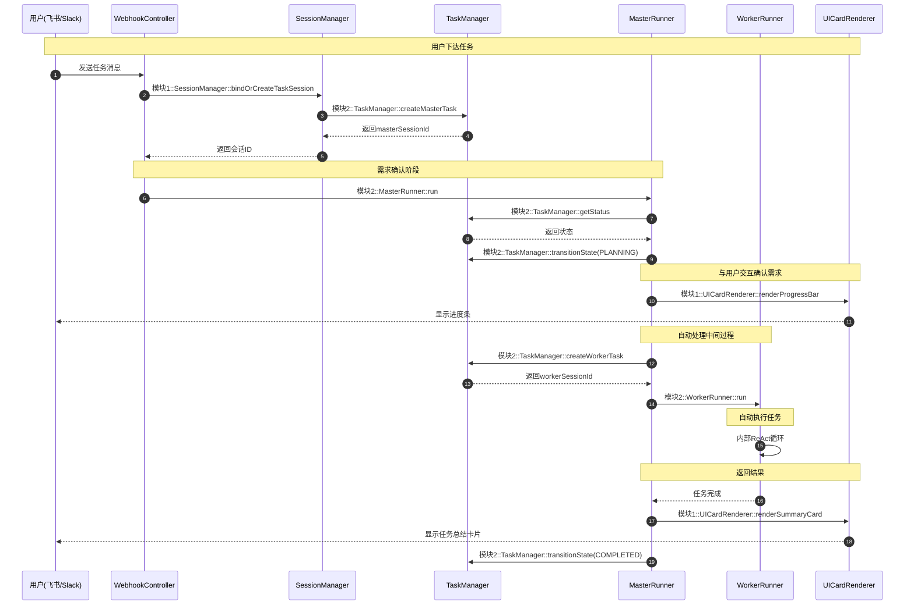

# 1.1 结果导向的极简体验

## 功能描述
系统的根本目的是让用户与AI Agent交互解决问题。用户只需下达任务并确认需求，所有的中间执行过程最大化交由Agent自动处理。

## 时序图

```mermaid
sequenceDiagram
    autonumber

    participant User as 用户(飞书/Slack)
    participant WC as WebhookController
    participant SM as SessionManager
    participant TM as TaskManager
    participant MR as MasterRunner
    participant WR as WorkerRunner
    participant UIR as UICardRenderer

    Note over User,UIR: 用户下达任务
    User->>WC: 发送任务消息
    WC->>SM: 模块1::SessionManager::bindOrCreateTaskSession
    SM->>TM: 模块2::TaskManager::createMasterTask
    TM-->>SM: 返回masterSessionId
    SM-->>WC: 返回会话ID

    Note over WC,MR: 需求确认阶段
    WC->>MR: 模块2::MasterRunner::run
    MR->>TM: 模块2::TaskManager::getStatus
    TM-->>MR: 返回状态

    MR->>TM: 模块2::TaskManager::transitionState(PLANNING)

    Note over MR,UIR: 与用户交互确认需求
    MR->>UIR: 模块1::UICardRenderer::renderProgressBar
    UIR-->>User: 显示进度条

    Note over MR,WR: 自动处理中间过程
    MR->>TM: 模块2::TaskManager::createWorkerTask
    TM-->>MR: 返回workerSessionId
    MR->>WR: 模块2::WorkerRunner::run

    Note over WR: 自动执行任务
    WR->>WR: 内部ReAct循环

    Note over MR,UIR: 返回结果
    WR-->>MR: 任务完成
    MR->>UIR: 模块1::UICardRenderer::renderSummaryCard
    UIR-->>User: 显示任务总结卡片

    MR->>TM: 模块2::TaskManager::transitionState(COMPLETED)
```
