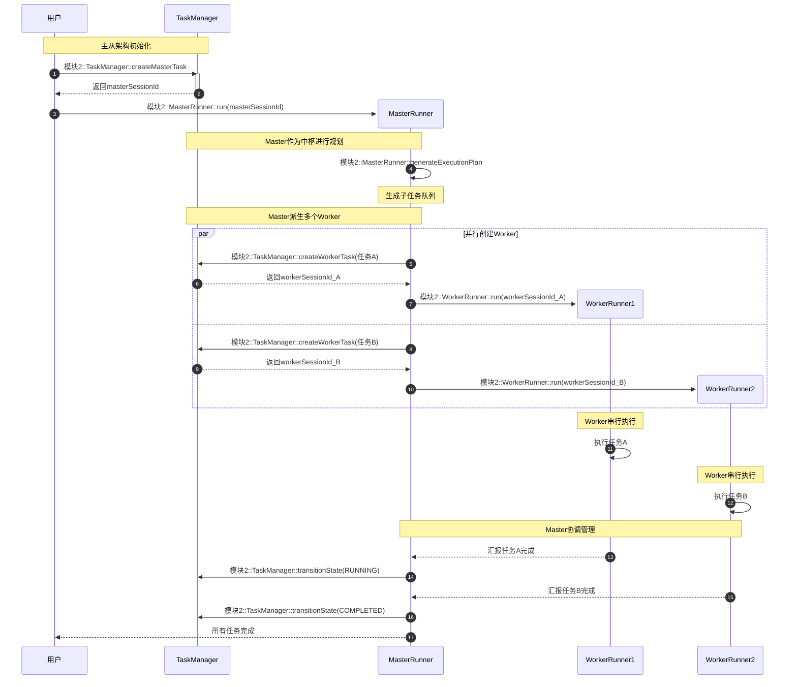

# 1.2 主从层级架构 (Master-Worker)

## 功能描述
系统包含一个"总Agent"(Master)和多个"子Agent"(Worker)，采用主从层级架构进行任务编排。

## 时序图

```mermaid
sequenceDiagram
    autonumber

    participant User as 用户
    participant TM as TaskManager
    %% 移除了 MR, WR1, WR2 的顶部声明，改为在下方动态创建时定义

    Note over User,TM: 主从架构初始化

    User->>TM: 模块2::TaskManager::createMasterTask
    activate TM
    TM-->>User: 返回masterSessionId
    deactivate TM

    create participant MR as MasterRunner
    User->>MR: 模块2::MasterRunner::run(masterSessionId)

    Note over TM,MR: Master作为中枢进行规划
    MR->>MR: 模块2::MasterRunner::generateExecutionPlan
    Note over MR: 生成子任务队列

    Note over TM,MR: Master派生多个Worker

    par 并行创建Worker
        MR->>TM: 模块2::TaskManager::createWorkerTask(任务A)
        TM-->>MR: 返回workerSessionId_A
        create participant WR1 as WorkerRunner1
        MR->>WR1: 模块2::WorkerRunner::run(workerSessionId_A)
    and
        MR->>TM: 模块2::TaskManager::createWorkerTask(任务B)
        TM-->>MR: 返回workerSessionId_B
        create participant WR2 as WorkerRunner2
        MR->>WR2: 模块2::WorkerRunner::run(workerSessionId_B)
    end

    Note over WR1: Worker串行执行
    WR1->>WR1: 执行任务A

    Note over WR2: Worker串行执行
    WR2->>WR2: 执行任务B

    Note over MR,WR2: Master协调管理
    WR1-->>MR: 汇报任务A完成
    MR->>TM: 模块2::TaskManager::transitionState(RUNNING)

    WR2-->>MR: 汇报任务B完成
    MR->>TM: 模块2::TaskManager::transitionState(COMPLETED)

    MR-->>User: 所有任务完成
```
