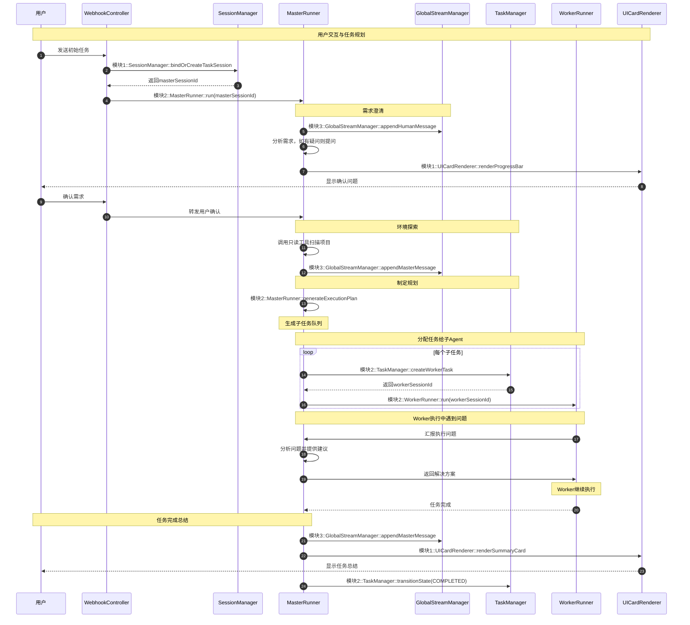

# 1.3 总Agent作为中枢

## 功能描述
总Agent作为中枢，全权负责与用户交互、任务规划、分配任务给子Agent，并解答子Agent在执行中遇到的问题。

## 时序图

```mermaid
sequenceDiagram
    autonumber

    participant User as 用户
    participant WC as WebhookController
    participant SM as SessionManager
    participant MR as MasterRunner
    participant GSM as GlobalStreamManager
    participant TM as TaskManager
    participant WR as WorkerRunner
    participant UIR as UICardRenderer

    Note over User,UIR: 用户交互与任务规划

    User->>WC: 发送初始任务
    WC->>SM: 模块1::SessionManager::bindOrCreateTaskSession
    SM-->>WC: 返回masterSessionId
    WC->>MR: 模块2::MasterRunner::run(masterSessionId)

    Note over MR,GSM: 需求澄清
    MR->>GSM: 模块3::GlobalStreamManager::appendHumanMessage
    MR->>MR: 分析需求，如有疑问则提问
    MR->>UIR: 模块1::UICardRenderer::renderProgressBar
    UIR-->>User: 显示确认问题

    User->>WC: 确认需求
    WC->>MR: 转发用户确认

    Note over MR,TM: 环境探索
    MR->>MR: 调用只读工具扫描项目
    MR->>GSM: 模块3::GlobalStreamManager::appendMasterMessage

    Note over MR,TM: 制定规划
    MR->>MR: 模块2::MasterRunner::generateExecutionPlan
    Note over MR: 生成子任务队列

    Note over MR,WR: 分配任务给子Agent
    loop 每个子任务
        MR->>TM: 模块2::TaskManager::createWorkerTask
        TM-->>MR: 返回workerSessionId
        MR->>WR: 模块2::WorkerRunner::run(workerSessionId)
    end

    Note over WR,MR: Worker执行中遇到问题
    WR->>MR: 汇报执行问题
    MR->>MR: 分析问题并提供建议
    MR->>WR: 返回解决方案

    Note over WR: Worker继续执行
    WR-->>MR: 任务完成

    Note over MR,User: 任务完成总结
    MR->>GSM: 模块3::GlobalStreamManager::appendMasterMessage
    MR->>UIR: 模块1::UICardRenderer::renderSummaryCard
    UIR-->>User: 显示任务总结
    MR->>TM: 模块2::TaskManager::transitionState(COMPLETED)
```
