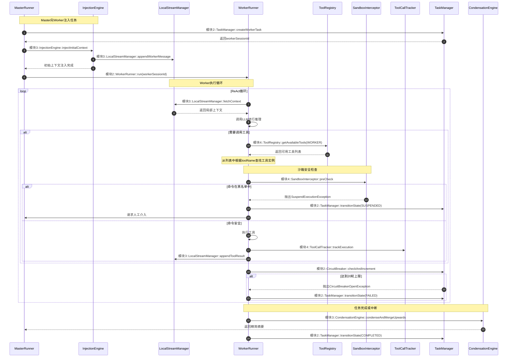

# 1.4 子Agent作为执行单元

## 功能描述
子Agent作为执行单元，严格听从总Agent的调度，在隔离的上下文中完成分配的具体任务。

## 时序图

```mermaid
sequenceDiagram
    autonumber

    participant MR as MasterRunner
    participant IE as InjectionEngine
    participant LSM as LocalStreamManager
    participant WR as WorkerRunner
    participant TR as ToolRegistry
    participant SI as SandboxInterceptor
    participant TCT as ToolCallTracker
    participant TM as TaskManager
    participant CE as CondensationEngine

    Note over MR,IE: Master向Worker注入任务

    MR->>TM: 模块2::TaskManager::createWorkerTask
    TM-->>MR: 返回workerSessionId
    MR->>IE: 模块3::InjectionEngine::injectInitialContext
    IE->>LSM: 模块3::LocalStreamManager::appendWorkerMessage
    IE-->>MR: 初始上下文注入完成

    MR->>WR: 模块2::WorkerRunner::run(workerSessionId)

    Note over WR,LSM: Worker执行循环

    loop ReAct循环
        WR->>LSM: 模块3::LocalStreamManager::fetchContext
        LSM-->>WR: 返回局部上下文

        WR->>WR: 调用LLM进行推理

        alt 需要调用工具
            WR->>TR: 模块4::ToolRegistry::getAvailableTools(WORKER)
            TR-->>WR: 返回可用工具列表
            Note over WR: 从列表中根据toolName查找工具实例

            Note over WR,SI: 沙箱安全检查
            WR->>SI: 模块4::SandboxInterceptor::preCheck
            alt 命令在黑名单中
                SI-->>WR: 抛出SuspendExecutionException
                WR->>TM: 模块2::TaskManager::transitionState(SUSPENDED)
                WR->>MR: 请求人工介入
            else 命令安全
                WR->>WR: 执行工具
                WR->>TCT: 模块4::ToolCallTracker::trackExecution
                WR->>LSM: 模块3::LocalStreamManager::appendToolResult
            end
        end

        WR->>TM: 模块2::CircuitBreaker::checkAndIncrement
        alt 达到20轮上限
            TM-->>WR: 抛出CircuitBreakerOpenException
            WR->>TM: 模块2::TaskManager::transitionState(FAILED)
        end
    end

    Note over WR,CE: 任务完成或中断
    WR->>CE: 模块3::CondensationEngine::condenseAndMergeUpwards
    CE-->>MR: 返回精简摘要
    WR->>TM: 模块2::TaskManager::transitionState(COMPLETED)
```
