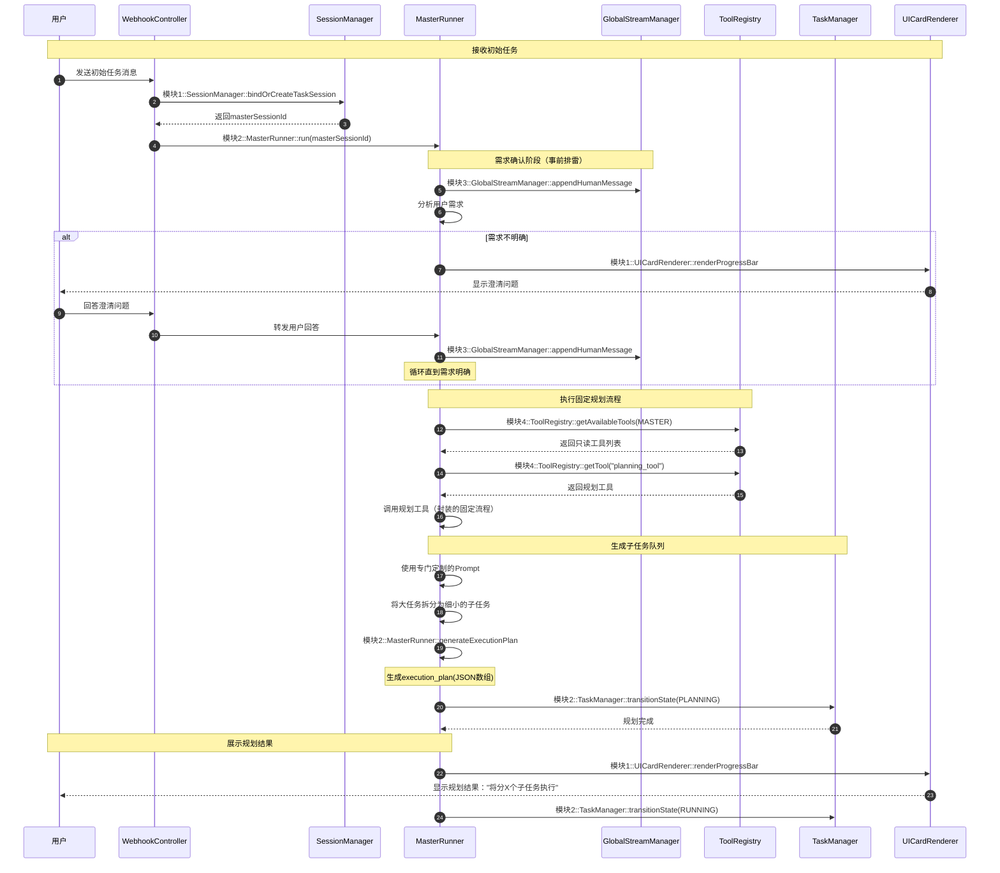

# 2.1 事前排雷与固定规划

## 功能描述
接收到初始任务后，总Agent会先与用户进行彻底的需求确认。确认无误后，总Agent必须执行一段固定的"规划流程"（该流程被封装为工具），并通过专门定制的Prompt将大任务拆分为细小的子任务下发。

## 时序图

```mermaid
sequenceDiagram
    autonumber

    participant User as 用户
    participant WC as WebhookController
    participant SM as SessionManager
    participant MR as MasterRunner
    participant GSM as GlobalStreamManager
    participant TR as ToolRegistry
    participant TM as TaskManager
    participant UIR as UICardRenderer

    Note over User,UIR: 接收初始任务

    User->>WC: 发送初始任务消息
    WC->>SM: 模块1::SessionManager::bindOrCreateTaskSession
    SM-->>WC: 返回masterSessionId
    WC->>MR: 模块2::MasterRunner::run(masterSessionId)

    Note over MR,GSM: 需求确认阶段（事前排雷）

    MR->>GSM: 模块3::GlobalStreamManager::appendHumanMessage
    MR->>MR: 分析用户需求

    alt 需求不明确
        MR->>UIR: 模块1::UICardRenderer::renderProgressBar
        UIR-->>User: 显示澄清问题

        User->>WC: 回答澄清问题
        WC->>MR: 转发用户回答
        MR->>GSM: 模块3::GlobalStreamManager::appendHumanMessage

        Note over MR: 循环直到需求明确
    end

    Note over MR,TR: 执行固定规划流程

    MR->>TR: 模块4::ToolRegistry::getAvailableTools(MASTER)
    TR-->>MR: 返回只读工具列表

    MR->>TR: 模块4::ToolRegistry::getTool("planning_tool")
    TR-->>MR: 返回规划工具

    MR->>MR: 调用规划工具（封装的固定流程）

    Note over MR,TM: 生成子任务队列

    MR->>MR: 使用专门定制的Prompt
    MR->>MR: 将大任务拆分为细小的子任务
    MR->>MR: 模块2::MasterRunner::generateExecutionPlan
    Note over MR: 生成execution_plan(JSON数组)

    MR->>TM: 模块2::TaskManager::transitionState(PLANNING)
    TM-->>MR: 规划完成

    Note over MR,User: 展示规划结果

    MR->>UIR: 模块1::UICardRenderer::renderProgressBar
    UIR-->>User: 显示规划结果："将分X个子任务执行"

    MR->>TM: 模块2::TaskManager::transitionState(RUNNING)
```
