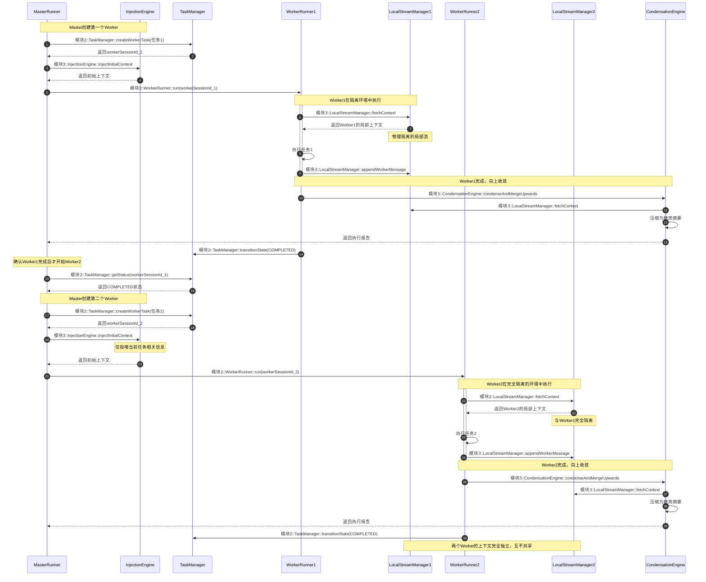

# 2.2 严格串行与状态隔离

## 功能描述
子Agent的执行是严格串行的。各个子Agent之间完全隔离，不共享任何上下文；子Agent所有的上下文信息仅来源于总Agent的单向投喂。

## 时序图

```mermaid
sequenceDiagram
    autonumber

    participant MR as MasterRunner
    participant IE as InjectionEngine
    participant TM as TaskManager
    participant WR1 as WorkerRunner1
    participant LSM1 as LocalStreamManager1
    participant WR2 as WorkerRunner2
    participant LSM2 as LocalStreamManager2
    participant CE as CondensationEngine

    Note over MR,IE: Master创建第一个Worker

    MR->>TM: 模块2::TaskManager::createWorkerTask(任务1)
    TM-->>MR: 返回workerSessionId_1
    MR->>IE: 模块3::InjectionEngine::injectInitialContext
    IE-->>MR: 返回初始上下文

    MR->>WR1: 模块2::WorkerRunner::run(workerSessionId_1)

    Note over WR1,LSM1: Worker1在隔离环境中执行

    activate WR1
    WR1->>LSM1: 模块3::LocalStreamManager::fetchContext
    LSM1-->>WR1: 返回Worker1的局部上下文
    Note over LSM1: 物理隔离的局部流

    WR1->>WR1: 执行任务1
    WR1->>LSM1: 模块3::LocalStreamManager::appendWorkerMessage
    deactivate WR1

    Note over WR1,CE: Worker1完成，向上收敛

    WR1->>CE: 模块3::CondensationEngine::condenseAndMergeUpwards
    CE->>LSM1: 模块3::LocalStreamManager::fetchContext
    CE->>CE: 压缩为精简摘要
    CE-->>MR: 返回执行报告

    WR1->>TM: 模块2::TaskManager::transitionState(COMPLETED)

    Note over MR: 确认Worker1完成后才开始Worker2

    MR->>TM: 模块2::TaskManager::getStatus(workerSessionId_1)
    TM-->>MR: 返回COMPLETED状态

    Note over MR,IE: Master创建第二个Worker

    MR->>TM: 模块2::TaskManager::createWorkerTask(任务2)
    TM-->>MR: 返回workerSessionId_2
    MR->>IE: 模块3::InjectionEngine::injectInitialContext
    Note over IE: 仅投喂当前任务相关信息
    IE-->>MR: 返回初始上下文

    MR->>WR2: 模块2::WorkerRunner::run(workerSessionId_2)

    Note over WR2,LSM2: Worker2在完全隔离的环境中执行

    activate WR2
    WR2->>LSM2: 模块3::LocalStreamManager::fetchContext
    LSM2-->>WR2: 返回Worker2的局部上下文
    Note over LSM2: 与Worker1完全隔离

    WR2->>WR2: 执行任务2
    WR2->>LSM2: 模块3::LocalStreamManager::appendWorkerMessage
    deactivate WR2

    Note over WR2,CE: Worker2完成，向上收敛

    WR2->>CE: 模块3::CondensationEngine::condenseAndMergeUpwards
    CE->>LSM2: 模块3::LocalStreamManager::fetchContext
    CE->>CE: 压缩为精简摘要
    CE-->>MR: 返回执行报告

    WR2->>TM: 模块2::TaskManager::transitionState(COMPLETED)

    Note over LSM1,LSM2: 两个Worker的上下文完全独立，互不共享
```
