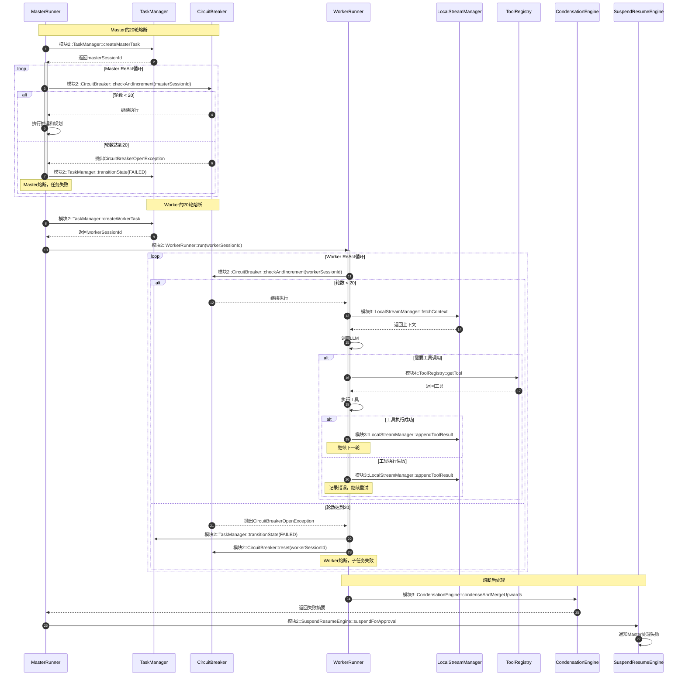

# 2.3 死循环熔断机制

## 功能描述
为避免任务卡死，总Agent与单一子Agent针对某一环节的对话轮数上限被严格固定为20轮。

## 时序图

```mermaid
sequenceDiagram
    autonumber

    participant MR as MasterRunner
    participant TM as TaskManager
    participant CB as CircuitBreaker
    participant WR as WorkerRunner
    participant LSM as LocalStreamManager
    participant TR as ToolRegistry
    participant CE as CondensationEngine
    participant RE as SuspendResumeEngine

    Note over MR,CB: Master的20轮熔断

    MR->>TM: 模块2::TaskManager::createMasterTask
    TM-->>MR: 返回masterSessionId

    activate MR
    loop Master ReAct循环
        MR->>CB: 模块2::CircuitBreaker::checkAndIncrement(masterSessionId)

        alt 轮数 < 20
            CB-->>MR: 继续执行
            MR->>MR: 执行推理和规划
        else 轮数达到20
            CB-->>MR: 抛出CircuitBreakerOpenException
            MR->>TM: 模块2::TaskManager::transitionState(FAILED)
            deactivate MR
            Note over MR: Master熔断，任务失败
        end
    end

    Note over TM,CB: Worker的20轮熔断

    MR->>TM: 模块2::TaskManager::createWorkerTask
    TM-->>MR: 返回workerSessionId
    MR->>WR: 模块2::WorkerRunner::run(workerSessionId)

    activate WR
    loop Worker ReAct循环
        WR->>CB: 模块2::CircuitBreaker::checkAndIncrement(workerSessionId)

        alt 轮数 < 20
            CB-->>WR: 继续执行
            WR->>LSM: 模块3::LocalStreamManager::fetchContext
            LSM-->>WR: 返回上下文

            WR->>WR: 调用LLM

            alt 需要工具调用
                WR->>TR: 模块4::ToolRegistry::getTool
                TR-->>WR: 返回工具
                WR->>WR: 执行工具

                alt 工具执行成功
                    WR->>LSM: 模块3::LocalStreamManager::appendToolResult
                    Note over WR: 继续下一轮
                else 工具执行失败
                    WR->>LSM: 模块3::LocalStreamManager::appendToolResult
                    Note over WR: 记录错误，继续重试
                end
            end
        else 轮数达到20
            CB-->>WR: 抛出CircuitBreakerOpenException
            WR->>TM: 模块2::TaskManager::transitionState(FAILED)
            WR->>CB: 模块2::CircuitBreaker::reset(workerSessionId)
            deactivate WR
            Note over WR: Worker熔断，子任务失败
        end
    end

    Note over WR,RE: 熔断后处理

    WR->>CE: 模块3::CondensationEngine::condenseAndMergeUpwards
    CE-->>MR: 返回失败摘要

    MR->>RE: 模块2::SuspendResumeEngine::suspendForApproval
    RE->>RE: 通知Master处理失败
```
