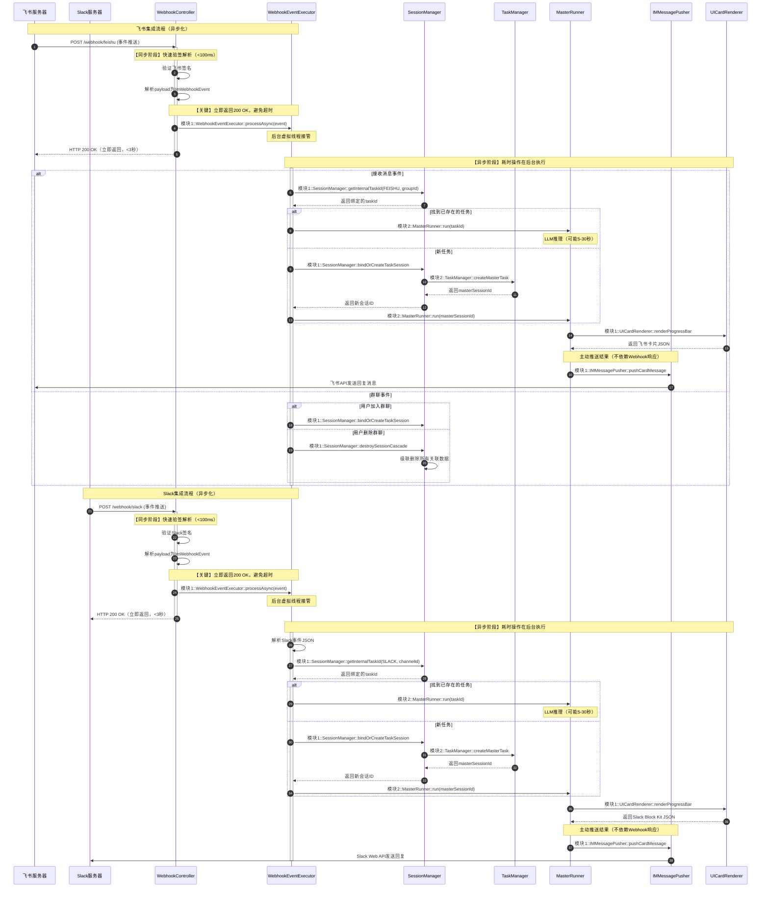

# 3.1 深度接入办公IM

## 功能描述
用户端完全基于IM软件操作，系统需集成飞书(Feishu)和Slack。

## 时序图

```mermaid
sequenceDiagram
    autonumber

    participant Feishu as 飞书服务器
    participant Slack as Slack服务器
    participant WC as WebhookController
    participant EE as WebhookEventExecutor
    participant SM as SessionManager
    participant TM as TaskManager
    participant MR as MasterRunner
    participant IMP as IMMessagePusher
    participant UIR as UICardRenderer

    Note over Feishu,EE: 飞书集成流程（异步化）

        Feishu->>WC: POST /webhook/feishu (事件推送)
        activate WC

        Note over WC: 【同步阶段】快速验签解析（<100ms）

        WC->>WC: 验证飞书签名
        WC->>WC: 解析payload为ImWebhookEvent

        Note over WC,EE: 【关键】立即返回200 OK，避免超时

        WC->>EE: 模块1::WebhookEventExecutor::processAsync(event)
        Note over EE: 后台虚拟线程接管

        WC-->>Feishu: HTTP 200 OK（立即返回，<3秒）
        deactivate WC

        Note over EE,UIR: 【异步阶段】耗时操作在后台执行

        activate EE

        alt 接收消息事件
            EE->>SM: 模块1::SessionManager::getInternalTaskId(FEISHU, groupId)
            SM-->>EE: 返回绑定的taskId

            alt 找到已存在的任务
                EE->>MR: 模块2::MasterRunner::run(taskId)
                Note over MR: LLM推理（可能5-30秒）
            else 新任务
                EE->>SM: 模块1::SessionManager::bindOrCreateTaskSession
                SM->>TM: 模块2::TaskManager::createMasterTask
                TM-->>SM: 返回masterSessionId
                SM-->>EE: 返回新会话ID
                EE->>MR: 模块2::MasterRunner::run(masterSessionId)
            end

            MR->>UIR: 模块1::UICardRenderer::renderProgressBar
            UIR-->>MR: 返回飞书卡片JSON

            Note over MR,IMP: 主动推送结果（不依赖Webhook响应）

            MR->>IMP: 模块1::IMMessagePusher::pushCardMessage
            IMP->>Feishu: 飞书API发送回复消息

        else 群聊事件
            alt 用户加入群聊
                EE->>SM: 模块1::SessionManager::bindOrCreateTaskSession
            else 用户删除群聊
                EE->>SM: 模块1::SessionManager::destroySessionCascade
                SM->>SM: 级联删除所有关联数据
            end
        end

        deactivate EE

    Note over Slack,EE: Slack集成流程（异步化）

        Slack->>WC: POST /webhook/slack (事件推送)
        activate WC

        Note over WC: 【同步阶段】快速验签解析（<100ms）

        WC->>WC: 验证Slack签名
        WC->>WC: 解析payload为ImWebhookEvent

        Note over WC,EE: 【关键】立即返回200 OK，避免超时

        WC->>EE: 模块1::WebhookEventExecutor::processAsync(event)
        Note over EE: 后台虚拟线程接管

        WC-->>Slack: HTTP 200 OK（立即返回，<3秒）
        deactivate WC

        Note over EE,UIR: 【异步阶段】耗时操作在后台执行

        activate EE

        EE->>EE: 解析Slack事件JSON
        EE->>SM: 模块1::SessionManager::getInternalTaskId(SLACK, channelId)
        SM-->>EE: 返回绑定的taskId

        alt 找到已存在的任务
            EE->>MR: 模块2::MasterRunner::run(taskId)
            Note over MR: LLM推理（可能5-30秒）
        else 新任务
            EE->>SM: 模块1::SessionManager::bindOrCreateTaskSession
            SM->>TM: 模块2::TaskManager::createMasterTask
            TM-->>SM: 返回masterSessionId
            SM-->>EE: 返回新会话ID
            EE->>MR: 模块2::MasterRunner::run(masterSessionId)
        end

        MR->>UIR: 模块1::UICardRenderer::renderProgressBar
        UIR-->>MR: 返回Slack Block Kit JSON

        Note over MR,IMP: 主动推送结果（不依赖Webhook响应）

        MR->>IMP: 模块1::IMMessagePusher::pushCardMessage
        IMP->>Slack: Slack Web API发送回复

        deactivate EE
```
