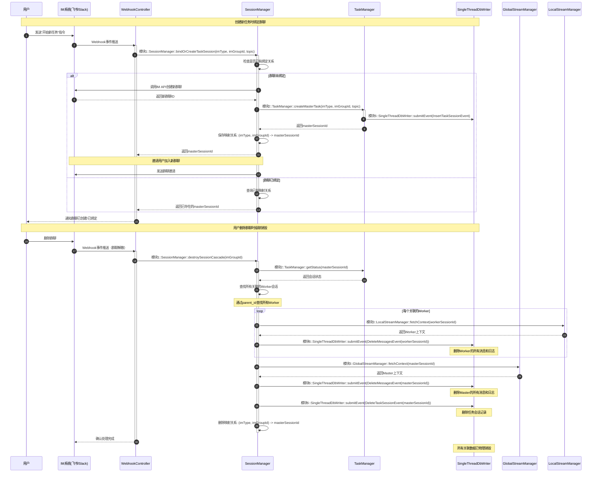

# 3.2 会话与群聊强绑定

## 功能描述
一次完整的任务（如分析某代码项目、完成某份报告）即为一次"会话"。每次开启新任务，系统自动新建一个专属群聊。当用户删除该群聊时，此次会话的所有关联数据也会被同步销毁。

## 时序图

```mermaid
sequenceDiagram
    autonumber

    participant User as 用户
    participant IM as IM系统(飞书/Slack)
    participant WC as WebhookController
    participant SM as SessionManager
    participant TM as TaskManager
    participant DB as SingleThreadDbWriter
    participant GSM as GlobalStreamManager
    participant LSM as LocalStreamManager

    Note over User,DB: 创建新任务时绑定群聊

    User->>IM: 发送"开始新任务"指令
    IM->>WC: Webhook事件推送
    activate WC

    WC->>SM: 模块1::SessionManager::bindOrCreateTaskSession(imType, imGroupId, topic)
    activate SM

    SM->>SM: 检查是否已有绑定关系

    alt 群聊未绑定
        SM->>IM: 调用IM API创建新群聊
        IM-->>SM: 返回新群聊ID

        SM->>TM: 模块2::TaskManager::createMasterTask(imType, imGroupId, topic)
        activate TM
        TM->>DB: 模块6::SingleThreadDbWriter::submitEvent(InsertTaskSessionEvent)
        deactivate TM
        TM-->>SM: 返回masterSessionId

        SM->>SM: 保存映射关系: (imType, imGroupId) -> masterSessionId
        SM-->>WC: 返回masterSessionId

        Note over SM,IM: 邀请用户加入新群聊
        SM->>IM: 发送群聊邀请
    else 群聊已绑定
        SM->>SM: 查询已有映射关系
        SM-->>WC: 返回已存在的masterSessionId
    end

    deactivate SM
    WC-->>User: 通知群聊已创建/已绑定

    deactivate WC

    Note over User,DB: 用户删除群聊时级联销毁

    User->>IM: 删除群聊
    IM->>WC: Webhook事件推送（群聊解散）
    activate WC

    WC->>SM: 模块1::SessionManager::destroySessionCascade(imGroupId)
    activate SM

    SM->>TM: 模块2::TaskManager::getStatus(masterSessionId)
    TM-->>SM: 返回会话状态

    SM->>SM: 查找所有关联的Worker会话
    Note over SM: 通过parent_id查找所有Worker

    loop 每个关联的Worker
        SM->>LSM: 模块3::LocalStreamManager::fetchContext(workerSessionId)
        LSM-->>SM: 返回Worker上下文
        SM->>DB: 模块6::SingleThreadDbWriter::submitEvent(DeleteMessagesEvent(workerSessionId))
        Note over DB: 删除Worker的所有消息和日志
    end

    SM->>GSM: 模块3::GlobalStreamManager::fetchContext(masterSessionId)
    GSM-->>SM: 返回Master上下文
    SM->>DB: 模块6::SingleThreadDbWriter::submitEvent(DeleteMessagesEvent(masterSessionId))
    Note over DB: 删除Master的所有消息和日志

    SM->>DB: 模块6::SingleThreadDbWriter::submitEvent(DeleteTaskSessionEvent(masterSessionId))
    Note over DB: 删除任务会话记录

    SM->>SM: 删除映射关系: (imType, imGroupId) -> masterSessionId

    deactivate SM
    WC-->>IM: 确认处理完成

    deactivate WC

    Note over DB: 所有关联数据已物理销毁
```
