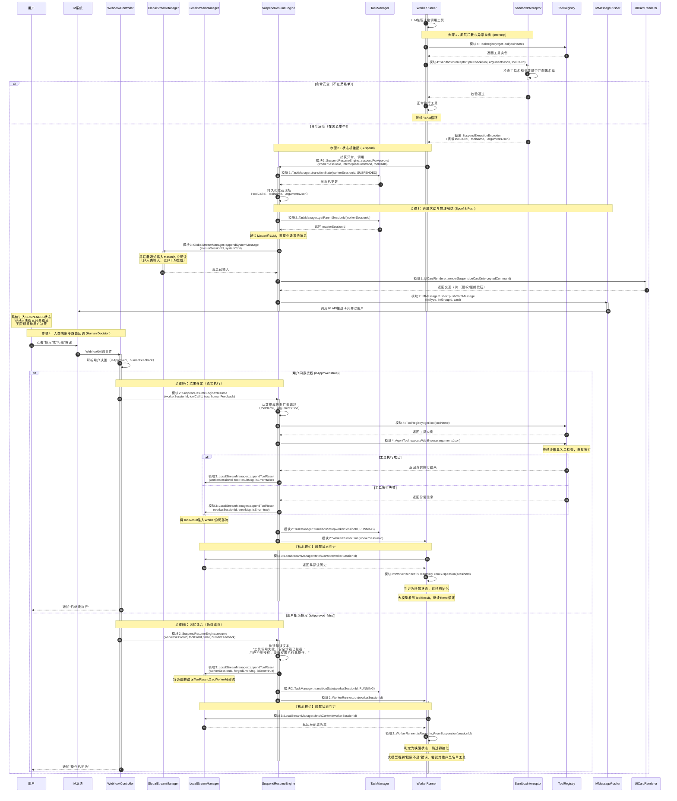

# 3.3 人机回环 (Human-in-the-loop)

## 功能描述
执行过程中系统默认静默运转。但当总/子Agent遇到敏感操作（触发黑名单）时，系统通过5步完美闭环实现"拦截-挂起-求助-决策-缝合"的全流程控制。

## 5步闭环概览

1. **底层拦截与异常抛出 (Intercept)** - SandboxInterceptor 拦截黑名单工具，抛出携带 toolCallId 的异常
2. **状态机挂起 (Suspend)** - SuspendResumeEngine 切换状态、持久化现场、Worker线程完全退出
3. **跨层求助与物理触达 (Spoof & Push)** - 越过 Master LLM，在全局流插入系统消息，推送 IM 卡片
4. **人类决断与路由回调 (Human Decision)** - 用户点击按钮，WebhookController 接收回调并路由
5. **结果落定与记忆缝合 (Execute/Forge & Resume)** - 根据用户决策执行真实工具或伪造错误，缝合上下文并唤醒 Worker

## 时序图



## 关键设计点说明

### 1. 步骤1：底层拦截 (Intercept)
- **SandboxInterceptor.preCheck()** 在工具执行前进行黑名单校验
- 抛出的异常必须携带 `toolCallId`（因果纽带），用于后续缝合上下文

### 2. 步骤2：状态机挂起 (Suspend)
- 状态从 `RUNNING` 切换为 `SUSPENDED`
- 持久化拦截现场（toolName、argumentsJson），供唤醒时恢复
- **Worker 线程完全退出**：`run()` 方法捕获异常后正常结束，释放所有线程和内存资源
- 系统进入挂起状态，仅依赖数据库持久化状态维持，不占用任何线程资源

### 3. 步骤3：跨层求助 (Spoof & Push)
- **越过 Master 的 LLM**：直接调用 `GlobalStreamManager.appendSystemMessage()` 插入系统消息
- **Master 仅作为中介**：不参与决策，只负责消息转发
- **主动推送**：通过 `IMMessagePusher` 将卡片推送到群聊

### 4. 步骤4：人类决策 (Human Decision)
- WebhookController 接收 IM 回调
- 解析用户决策（授权/拒绝/补充指令）
- 路由到 `SuspendResumeEngine.resume()`

### 5. 步骤5：结果落定与记忆缝合 (Execute/Forge & Resume)
- **同意时**：调用 `AgentTool.executeWithBypass()` 绕过沙箱，返回真实结果
- **拒绝时**：伪造"权限不足"错误，不执行任何底层操作
- **ToolResult 缝合**：注入 `LocalStreamManager`，通过 `toolCallId` 关联
- **状态保持 RUNNING**：不立即终止，给模型探索替代方案的机会
- **唤醒 Worker**：创建**新线程**重新调用 `WorkerRunner.run(sessionId)`
- **【核心规约】唤醒状态判定**：
  - 新线程必须先调用 `isResumingFromSuspension(sessionId)` 检查是否为唤醒状态
  - 检查 LocalStream 中最后一条消息是否为 ToolResult
  - 如果是，则跳过初始化（不调用 InjectionEngine），直接基于上下文继续 ReAct 循环
  - 这避免了重复初始化导致的死循环问题

## 状态转换图

```
正常执行: RUNNING
    ↓
触发黑名单拦截
    ↓
    SUSPENDED (挂起，等待用户决策)
    ↓
用户决策
    ↓
┌───────────┴───────────┐
↓                       ↓
同意                   拒绝
↓                       ↓
执行真实工具          伪造错误ToolResult
↓                       ↓
    └───────────┬───────────┘
                ↓
            RUNNING (继续ReAct循环)
```

## 与其他组件的协作

- **模块1（接入与路由）**：WebhookController 接收用户决策，IMMessagePusher 推送卡片
- **模块2（状态机与调度）**：TaskManager 管理状态转换，SuspendResumeEngine 协调整个流程，WorkerRunner 实现唤醒状态判定
- **模块3（双流上下文）**：GlobalStreamManager 跨 Agent 伪造消息，LocalStreamManager 注入 ToolResult
- **模块4（工具链与沙箱）**：SandboxInterceptor 拦截危险操作，AgentTool 提供 bypass 执行模式
