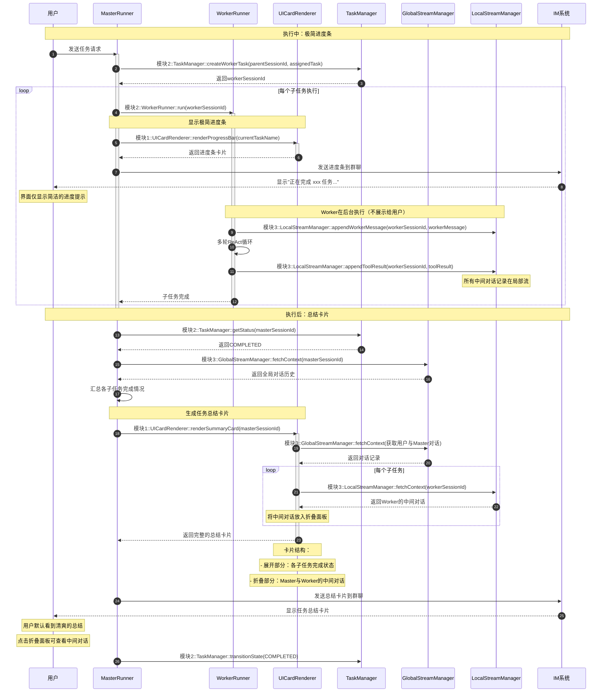

# 3.4 极简UI与总结卡片

## 功能描述
- **执行中**：群聊内仅显示用户与总Agent的对话，以及极其简短的进度条（仅提示"正在完成xxx任务..."）
- **执行后**：总Agent返回一张任务总结卡片，展示各子任务的完成情况。总Agent与子Agent在执行过程中的中间对话，默认收纳在卡片的折叠面板中，保持界面清爽。

## 时序图

```mermaid
sequenceDiagram
    autonumber

    participant User as 用户
    participant MR as MasterRunner
    participant WR as WorkerRunner
    participant UIR as UICardRenderer
    participant TM as TaskManager
    participant GSM as GlobalStreamManager
    participant LSM as LocalStreamManager
    participant IM as IM系统

    Note over User,IM: 执行中：极简进度条

    User->>MR: 发送任务请求
    activate MR

    MR->>TM: 模块2::TaskManager::createWorkerTask(parentSessionId, assignedTask)
    TM-->>MR: 返回workerSessionId

    loop 每个子任务执行
        MR->>WR: 模块2::WorkerRunner::run(workerSessionId)
        activate WR

        Note over MR,UIR: 显示极简进度条
        MR->>UIR: 模块1::UICardRenderer::renderProgressBar(currentTaskName)
        activate UIR
        UIR-->>MR: 返回进度条卡片
        deactivate UIR

        MR->>IM: 发送进度条到群聊
        IM-->>User: 显示"正在完成 xxx 任务..."

        Note over User: 界面仅显示简洁的进度提示

        Note over WR,LSM: Worker在后台执行（不展示给用户）
        WR->>LSM: 模块3::LocalStreamManager::appendWorkerMessage(workerSessionId, workerMessage)
        WR->>WR: 多轮ReAct循环
        WR->>LSM: 模块3::LocalStreamManager::appendToolResult(workerSessionId, toolResult)
        Note over LSM: 所有中间对话记录在局部流

        WR-->>MR: 子任务完成
        deactivate WR
    end

    Note over User,IM: 执行后：总结卡片

    deactivate MR

    MR->>TM: 模块2::TaskManager::getStatus(masterSessionId)
    TM-->>MR: 返回COMPLETED

    MR->>GSM: 模块3::GlobalStreamManager::fetchContext(masterSessionId)
    GSM-->>MR: 返回全局对话历史

    MR->>MR: 汇总各子任务完成情况

    Note over MR,UIR: 生成任务总结卡片
    MR->>UIR: 模块1::UICardRenderer::renderSummaryCard(masterSessionId)
    activate UIR

    UIR->>GSM: 模块3::GlobalStreamManager::fetchContext(获取用户与Master对话)
    GSM-->>UIR: 返回对话记录

    loop 每个子任务
        UIR->>LSM: 模块3::LocalStreamManager::fetchContext(workerSessionId)
        LSM-->>UIR: 返回Worker的中间对话
        Note over UIR: 将中间对话放入折叠面板
    end

    UIR-->>MR: 返回完整的总结卡片
    deactivate UIR

    Note over UIR: 卡片结构：
    Note over UIR: - 展开部分：各子任务完成状态
    Note over UIR: - 折叠部分：Master与Worker的中间对话

    MR->>IM: 发送总结卡片到群聊
    IM-->>User: 显示任务总结卡片

    Note over User: 用户默认看到清爽的总结
    Note over User: 点击折叠面板可查看中间对话

    MR->>TM: 模块2::TaskManager::transitionState(COMPLETED)
```
