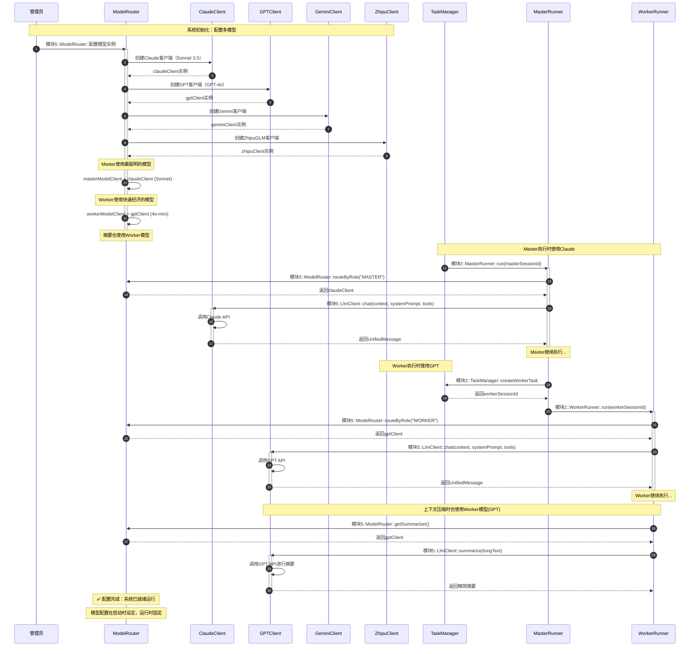

# 4.1 多模型灵活配置

## 功能描述
系统需兼容多种大语言模型（Claude、Gemini、GPT、ZhipuGLM）。总Agent和子Agent支持独立配置不同的LLM。

**配置说明：** 模型配置在系统启动时通过配置文件/环境变量设定，运行时不可动态更改。若需更换模型，需重启系统并修改配置。

## 时序图



---

## 配置方式

**启动时配置示例（application.yml）：**

```yaml
yesboss:
  llm:
    # Master 使用的模型（用于规划、决策）
    master:
      provider: claude
      model: claude-3-5-sonnet-20241022
      api-key: ${ANTHROPIC_API_KEY}

    # Worker 使用的模型（用于执行、摘要）
    worker:
      provider: openai
      model: gpt-4o-mini
      api-key: ${OPENAI_API_KEY}
```

**设计优势：**
1. ✅ **简单稳定**：避免运行时配置变更导致的意外行为
2. ✅ **易于测试**：配置固定，测试场景可预测
3. ✅ **成本可控**：通过配置文件控制模型使用，避免意外切换到昂贵模型

**如需更换模型：** 修改配置文件后重启系统即可
