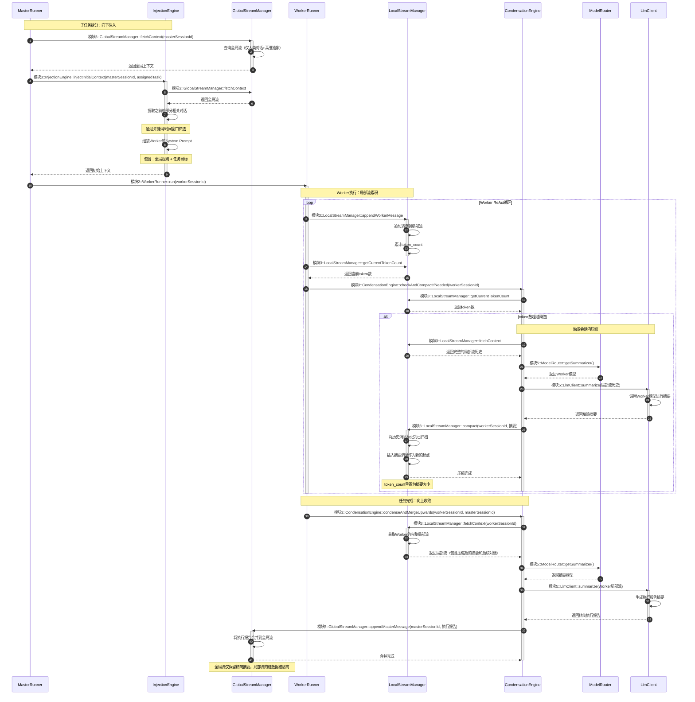

# 4.2 智能上下文切片与压缩

## 功能描述
在拆分子任务后，子Agent仅获取"之前的部分相关对话"以及"完成当前子任务产生的所有对话"。为了控制Token消耗，在单个子任务的会话内部必须实现自动的Compact（上下文压缩）机制。

## 时序图

```mermaid
sequenceDiagram
    autonumber

    participant MR as MasterRunner
    participant IE as InjectionEngine
    participant GSM as GlobalStreamManager
    participant WR as WorkerRunner
    participant LSM as LocalStreamManager
    participant CE as CondensationEngine
    participant MR2 as ModelRouter
    participant LC as LlmClient

    Note over MR,IE: 子任务拆分：向下注入

    MR->>GSM: 模块3::GlobalStreamManager::fetchContext(masterSessionId)
    activate GSM
    GSM->>GSM: 查询全局流（仅人类对话+高维抽象）
    GSM-->>MR: 返回全局上下文
    deactivate GSM

    MR->>IE: 模块3::InjectionEngine::injectInitialContext(masterSessionId, assignedTask)
    activate IE

    IE->>GSM: 模块3::GlobalStreamManager::fetchContext
    GSM-->>IE: 返回全局流

    IE->>IE: 提取之前的部分相关对话
    Note over IE: 通过关键词/时间窗口筛选

    IE->>IE: 组装Worker的System Prompt
    Note over IE: 包含：全局规则 + 任务目标

    IE-->>MR: 返回初始上下文
    deactivate IE

    MR->>WR: 模块2::WorkerRunner::run(workerSessionId)
    activate WR

    Note over WR,LSM: Worker执行：局部流累积

    loop Worker ReAct循环
        WR->>LSM: 模块3::LocalStreamManager::appendWorkerMessage
        activate LSM
        LSM->>LSM: 追加消息到局部流
        LSM->>LSM: 累计token_count
        deactivate LSM

        WR->>LSM: 模块3::LocalStreamManager::getCurrentTokenCount
        LSM-->>WR: 返回当前token数

        WR->>CE: 模块3::CondensationEngine::checkAndCompactIfNeeded(workerSessionId)
        activate CE

        CE->>LSM: 模块3::LocalStreamManager::getCurrentTokenCount
        LSM-->>CE: 返回token数

        alt token数超过阈值
            Note over CE,LC: 触发会话内压缩

            CE->>LSM: 模块3::LocalStreamManager::fetchContext
            LSM-->>CE: 返回完整的局部流历史

            CE->>MR2: 模块5::ModelRouter::getSummarizer()
            MR2-->>CE: 返回Worker模型

            CE->>LC: 模块5::LlmClient::summarize(局部流历史)
            activate LC
            LC->>LC: 调用Worker模型进行摘要
            LC-->>CE: 返回精简摘要
            deactivate LC

            CE->>LSM: 模块3::LocalStreamManager::compact(workerSessionId, 摘要)
            activate LSM
            LSM->>LSM: 将历史消息标记为已归档
            LSM->>LSM: 插入摘要消息作为新的起点
            LSM-->>CE: 压缩完成
            deactivate LSM

            Note over LSM: token_count重置为摘要大小
        end

        deactivate CE
    end

    deactivate WR

    Note over WR,CE: 任务完成：向上收敛

    WR->>CE: 模块3::CondensationEngine::condenseAndMergeUpwards(workerSessionId, masterSessionId)
    activate CE

    CE->>LSM: 模块3::LocalStreamManager::fetchContext(workerSessionId)
    activate LSM
    LSM->>LSM: 获取Worker的完整局部流
    LSM-->>CE: 返回局部流（包含压缩后的摘要和后续对话）
    deactivate LSM

    CE->>MR2: 模块5::ModelRouter::getSummarizer()
    MR2-->>CE: 返回摘要模型

    CE->>LC: 模块5::LlmClient::summarize(Worker局部流)
    activate LC
    LC->>LC: 生成执行报告摘要
    LC-->>CE: 返回精简执行报告
    deactivate LC

    CE->>GSM: 模块3::GlobalStreamManager::appendMasterMessage(masterSessionId, 执行报告)
    activate GSM
    GSM->>GSM: 将执行报告合并到全局流
    GSM-->>CE: 合并完成
    deactivate GSM

    deactivate CE

    Note over GSM: 全局流仅保留精简摘要，局部流的脏数据被隔离
```
