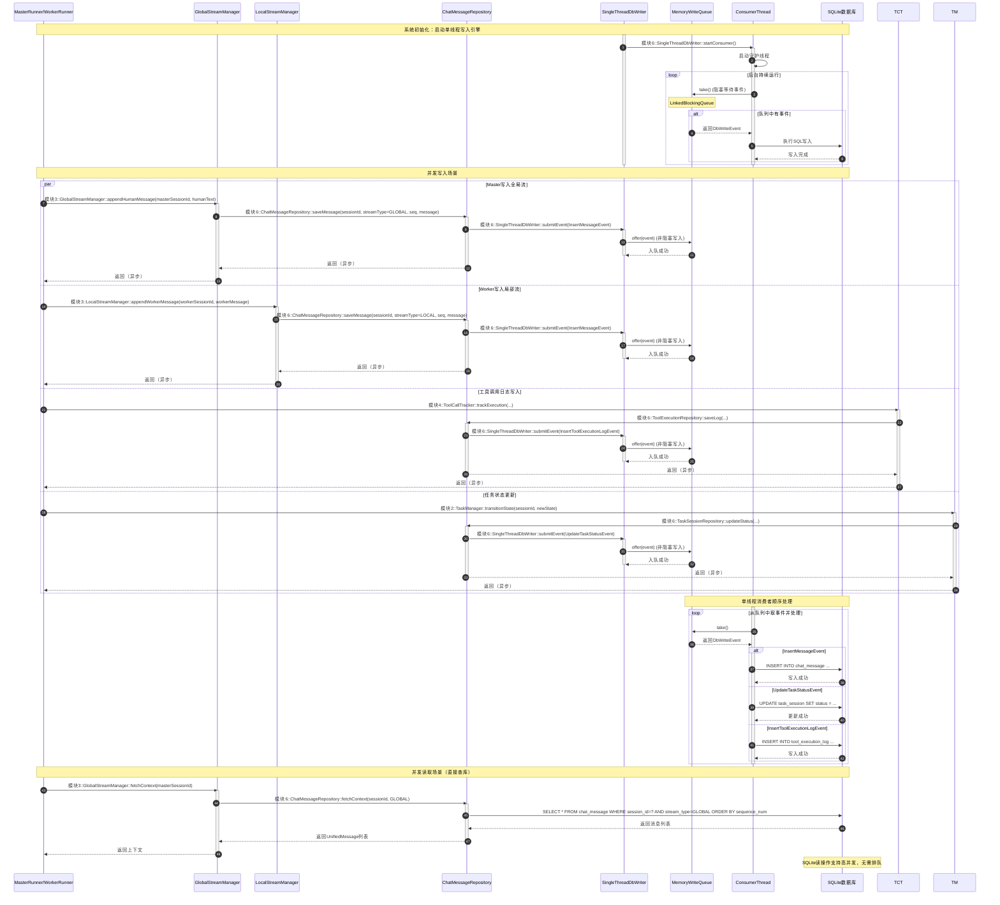

# 5.1 SQLite并发持久化

## 功能描述
所有的用户与Agent对话、Agent内部对话以及工具调用记录都必须完整保留。底层采用SQLite进行本地持久化，并在系统设计上必须重点解决和保障并发写的数据安全。

## 时序图

```mermaid
sequenceDiagram
    autonumber

    participant MA as MasterRunner/WorkerRunner
    participant GSM as GlobalStreamManager
    participant LSM as LocalStreamManager
    participant Repo as ChatMessageRepository
    participant DBW as SingleThreadDbWriter
    participant Queue as MemoryWriteQueue
    participant DT as ConsumerThread
    participant SQLite as SQLite数据库

    Note over MA,SQLite: 系统初始化：启动单线程写入引擎

    activate DBW
    DBW->>DT: 模块6::SingleThreadDbWriter::startConsumer()
    activate DT

    DT->>DT: 启动守护线程

    loop 后台持续运行
        DT->>Queue: take() (阻塞等待事件)
        Note over Queue: LinkedBlockingQueue

        alt 队列中有事件
            Queue-->>DT: 返回DbWriteEvent
            DT->>SQLite: 执行SQL写入
            SQLite-->>DT: 写入完成
        end
    end

    deactivate DT
    deactivate DBW

    Note over MA,SQLite: 并发写入场景

    par Master写入全局流
        MA->>GSM: 模块3::GlobalStreamManager::appendHumanMessage(masterSessionId, humanText)
        activate GSM
        GSM->>Repo: 模块6::ChatMessageRepository::saveMessage(sessionId, streamType=GLOBAL, seq, message)
        activate Repo
        Repo->>DBW: 模块6::SingleThreadDbWriter::submitEvent(InsertMessageEvent)
        activate DBW
        DBW->>Queue: offer(event) (非阻塞写入)
        Queue-->>DBW: 入队成功
        deactivate DBW
        Repo-->>GSM: 返回（异步）
        deactivate Repo
        GSM-->>MA: 返回（异步）
        deactivate GSM
    and Worker写入局部流
        MA->>LSM: 模块3::LocalStreamManager::appendWorkerMessage(workerSessionId, workerMessage)
        activate LSM
        LSM->>Repo: 模块6::ChatMessageRepository::saveMessage(sessionId, streamType=LOCAL, seq, message)
        activate Repo
        Repo->>DBW: 模块6::SingleThreadDbWriter::submitEvent(InsertMessageEvent)
        activate DBW
        DBW->>Queue: offer(event) (非阻塞写入)
        Queue-->>DBW: 入队成功
        deactivate DBW
        Repo-->>LSM: 返回（异步）
        deactivate Repo
        LSM-->>MA: 返回（异步）
        deactivate LSM
    and 工具调用日志写入
        MA->>TCT: 模块4::ToolCallTracker::trackExecution(...)
        activate TCT
        TCT->>Repo: 模块6::ToolExecutionRepository::saveLog(...)
        activate Repo
        Repo->>DBW: 模块6::SingleThreadDbWriter::submitEvent(InsertToolExecutionLogEvent)
        activate DBW
        DBW->>Queue: offer(event) (非阻塞写入)
        Queue-->>DBW: 入队成功
        deactivate DBW
        Repo-->>TCT: 返回（异步）
        deactivate Repo
        TCT-->>MA: 返回（异步）
        deactivate TCT
    and 任务状态更新
        MA->>TM: 模块2::TaskManager::transitionState(sessionId, newState)
        activate TM
        TM->>Repo: 模块6::TaskSessionRepository::updateStatus(...)
        activate Repo
        Repo->>DBW: 模块6::SingleThreadDbWriter::submitEvent(UpdateTaskStatusEvent)
        activate DBW
        DBW->>Queue: offer(event) (非阻塞写入)
        Queue-->>DBW: 入队成功
        deactivate DBW
        Repo-->>TM: 返回（异步）
        deactivate Repo
        TM-->>MA: 返回（异步）
        deactivate TM
    end

    Note over Queue,SQLite: 单线程消费者顺序处理

    activate DT
    loop 从队列中取事件并处理
        DT->>Queue: take()
        Queue-->>DT: 返回DbWriteEvent

        alt InsertMessageEvent
            DT->>SQLite: INSERT INTO chat_message ...
            SQLite-->>DT: 写入成功
        else UpdateTaskStatusEvent
            DT->>SQLite: UPDATE task_session SET status = ...
            SQLite-->>DT: 更新成功
        else InsertToolExecutionLogEvent
            DT->>SQLite: INSERT INTO tool_execution_log ...
            SQLite-->>DT: 写入成功
        end
    end
    deactivate DT

    Note over MA,SQLite: 并发读取场景（直接查库）

    MA->>GSM: 模块3::GlobalStreamManager::fetchContext(masterSessionId)
    activate GSM
    GSM->>Repo: 模块6::ChatMessageRepository::fetchContext(sessionId, GLOBAL)
    activate Repo
    Repo->>SQLite: SELECT * FROM chat_message WHERE session_id=? AND stream_type=GLOBAL ORDER BY sequence_num
    SQLite-->>Repo: 返回消息列表
    Repo-->>GSM: 返回UnifiedMessage列表
    deactivate Repo
    GSM-->>MA: 返回上下文
    deactivate GSM

    Note over SQLite: SQLite读操作支持高并发，无需排队
```
