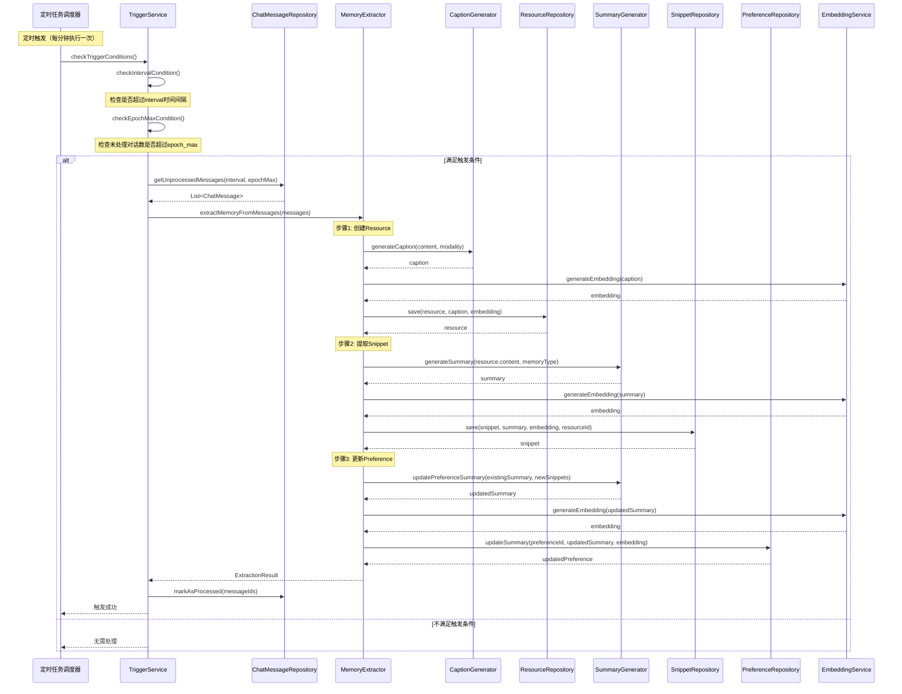

# 自动触发记忆提取流程

## 流程说明
定时任务检查触发条件（interval/epoch_max），如果满足条件则自动触发记忆提取流程。

## 参与者
- 定时任务调度器
- TriggerService: 触发条件检查服务
- ChatMessageRepository: 对话消息仓储
- ResourceRepository: 资源仓储
- SnippetRepository: 记忆片段仓储
- PreferenceRepository: 偏好仓储
- CaptionGenerator: 资源描述生成器
- SummaryGenerator: 记忆摘要生成器
- EmbeddingService: 向量化服务
- MemoryExtractor: 记忆提取器

## 时序图

## 接口方法说明

### TriggerService
- `checkTriggerConditions()`: 检查触发条件
- `checkIntervalCondition()`: 检查时间间隔条件
- `checkEpochMaxCondition()`: 检查对话数量条件

### ChatMessageRepository
- `getUnprocessedMessages(interval, epochMax)`: 获取未处理的消息
- `markAsProcessed(messageIds)`: 标记消息为已处理

### ResourceRepository
- `save(resource, caption, embedding)`: 保存资源及其描述和向量

### SnippetRepository
- `save(snippet, summary, embedding, resourceId)`: 保存记忆片段

### PreferenceRepository
- `updateSummary(preferenceId, summary, embedding)`: 更新偏好摘要

### CaptionGenerator
- `generateCaption(content, modality)`: 生成资源描述

### SummaryGenerator
- `generateSummary(content, memoryType)`: 生成记忆摘要
- `updatePreferenceSummary(existingSummary, newSnippets)`: 更新偏好摘要

### EmbeddingService
- `generateEmbedding(text)`: 生成文本向量
