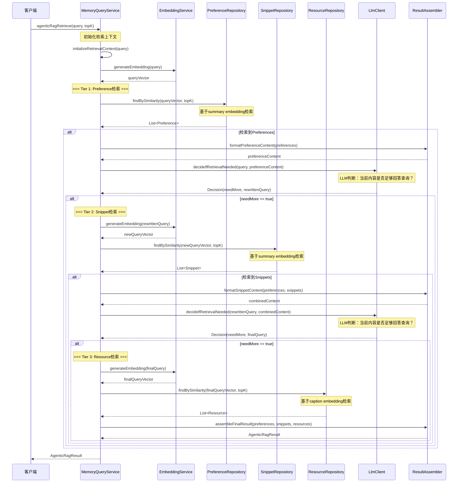

# Agentic RAG三层检索流程

## 流程说明
基于memU的Agentic RAG实现，分层检索记忆信息，每层检索后使用LLM判断是否需要继续检索。

## 参与者
- MemoryQueryService: 记忆查询服务
- EmbeddingService: 向量化服务
- PreferenceRepository: 偏好仓储
- SnippetRepository: 记忆片段仓储
- ResourceRepository: 资源仓储
- LlmClient: 大语言模型客户端
- ResultAssembler: 结果组装器

## 时序图



## LLM判断提示词

### 足够性检查系统提示词
```
你是一个专业的信息检索评估专家。你的任务是判断当前检索到的信息是否足够回答用户的查询。

评估标准：
1. 信息完整性：检索到的信息是否包含了回答查询所需的关键信息
2. 信息准确性：检索到的信息是否准确、可信
3. 信息相关性：检索到的信息是否与查询高度相关

输出格式：
<decision>
RETRIEVE | NO_RETRIEVE
</decision>
<reasoning>
判断理由
</reasoning>
<rewritten_query>
如果需要继续检索，请提供重写后的查询（可选）
</rewritten_query>
```

### 足够性检查用户提示词
```
# 用户查询
{query}

# 已检索到的内容
{retrieved_content}

# 对话历史
{conversation_history}

# 任务
请判断上述检索到的信息是否足够回答用户的查询。

# 输出要求
1. 如果信息足够，输出 <decision>NO_RETRIEVE</decision>
2. 如果信息不足，输出 <decision>RETRIEVE</decision> 并提供 <rewritten_query>
3. 在 <reasoning> 中说明判断理由
```

## 接口方法说明

### MemoryQueryService
- `agenticRagRetrieve(query, topK)`: 执行Agentic RAG检索
- `initializeRetrievalContext(query)`: 初始化检索上下文

### PreferenceRepository
- `findBySimilarity(queryVector, topK)`: 基于向量相似度检索偏好

### SnippetRepository
- `findBySimilarity(queryVector, topK)`: 基于向量相似度检索记忆片段

### ResourceRepository
- `findBySimilarity(queryVector, topK)`: 基于向量相似度检索资源

### EmbeddingService
- `generateEmbedding(text)`: 生成文本向量

### ResultAssembler
- `formatPreferenceContent(preferences)`: 格式化偏好内容
- `formatSnippetContent(preferences, snippets)`: 格式化组合内容
- `assembleFinalResult(preferences, snippets, resources)`: 组装最终结果

## 返回结果结构

```java
public class AgenticRagResult {
    private List<Preference> preferences;      // Tier 1检索结果
    private List<Snippet> snippets;           // Tier 2检索结果
    private List<Resource> resources;         // Tier 3检索结果
    private List<DecisionLog> decisionHistory; // LLM判断历史
    private String finalQuery;                // 最终查询（可能被重写）

    public class DecisionLog {
        private String tier;                   // 检索层级
        private boolean needMore;              // 是否需要更多检索
        private String reasoning;              // 判断理由
        private String rewrittenQuery;         // 重写后的查询
    }
}
```
