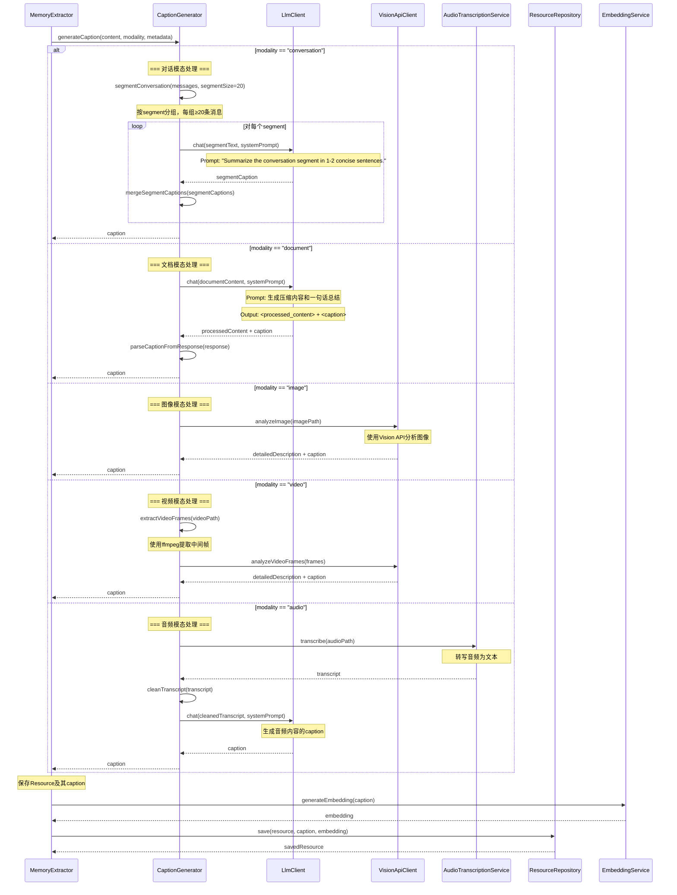

# Resource Caption生成流程

## 流程说明
基于memU的实现，对不同模态（modality）的Resource生成caption，支持conversation、document、image、video、audio等类型。

## 参与者
- MemoryExtractor: 记忆提取器
- CaptionGenerator: 资源描述生成器
- LlmClient: 大语言模型客户端
- VisionApiClient: 视觉API客户端（用于image/video）
- AudioTranscriptionService: 音频转写服务
- ResourceRepository: 资源仓储
- EmbeddingService: 向量化服务

## 时序图



## Prompt模板

### Conversation Caption生成
```python
system_prompt = """
Summarize the given conversation segment in 1-2 concise sentences.
Focus on the main topic or theme discussed.
"""
```

### Document Caption生成
```python
system_prompt = """
Process the following document and extract key information.

Output format:
<processed_content>
[condensed document content]
</processed_content>
<caption>
[one-sentence summary]
</caption>
"""
```

### Image/Video Caption生成
```python
system_prompt = """
Analyze this image/video and provide:
1. A detailed description of the visual content
2. A concise one-sentence caption

Output format:
<detailed_description>
[comprehensive description]
</detailed_description>
<caption>
[one-sentence summary]
</caption>
"""
```

### Audio Caption生成
```python
system_prompt = """
Generate a concise caption for the following audio transcript.

Requirements:
1. Summarize the main topic or content
2. Keep it to 1-2 sentences
3. Focus on key information discussed
"""
```

## 接口方法说明

### CaptionGenerator
- `generateCaption(content, modality, metadata)`: 生成资源描述
- `segmentConversation(messages, segmentSize)`: 将对话分段
- `mergeSegmentCaptions(segmentCaptions)`: 合并分段caption
- `parseCaptionFromResponse(response)`: 从LLM响应中解析caption
- `extractVideoFrames(videoPath)`: 提取视频帧
- `cleanTranscript(transcript)`: 清理转写文本

### VisionApiClient
- `analyzeImage(imagePath)`: 分析图像
- `analyzeVideoFrames(frames)`: 分析视频帧

### AudioTranscriptionService
- `transcribe(audioPath)`: 转写音频

### ResourceRepository
- `save(resource, caption, embedding)`: 保存资源

### EmbeddingService
- `generateEmbedding(text)`: 生成文本向量

## 配置参数

### Caption生成配置
```java
public class CaptionConfig {
    // Conversation配置
    private int conversationSegmentSize = 20;  // 对话分段大小

    // Document配置
    private int maxDocumentLength = 10000;     // 文档最大长度

    // Image/Video配置
    private int videoFrameCount = 5;           // 提取的视频帧数量

    // Audio配置
    private String transcriptionLanguage = "zh"; // 转写语言
}
```
