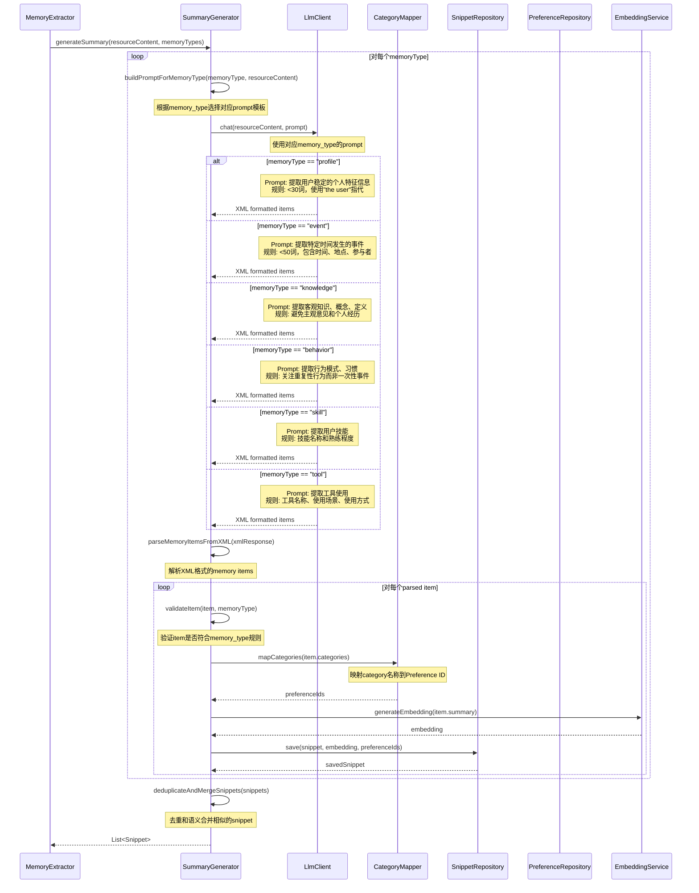

# Snippet Summary生成流程

## 流程说明
基于memU的实现，从Resource内容中提取Snippet并生成summary，支持6种memory_type（profile、event、knowledge、behavior、skill、tool）。

## 参与者
- MemoryExtractor: 记忆提取器
- SummaryGenerator: 摘要生成器
- LlmClient: 大语言模型客户端
- SnippetRepository: 记忆片段仓储
- PreferenceRepository: 偏好仓储
- EmbeddingService: 向量化服务
- CategoryMapper: 分类映射器

## 时序图



## Prompt模板（基于memU）

### Profile类型
```xml
<system_prompt>
# Task Objective
You are a professional User Memory Extractor. Your core task is to extract independent user memory items about the user from the given conversation.

# Rules
## General requirements
- Use "the user" to refer to the user consistently.
- Each memory item must be complete and self-contained, written as a declarative descriptive sentence.
- Each memory item must express one single complete piece of information and be understandable without context.
- Similar/redundant items must be merged into one.
- Each memory item must be < 30 words worth of length (keep it as concise as possible).
- A single memory item must NOT contain timestamps.

## Profile-specific rules
- Extract stable personal characteristics of the user
- Focus on long-term traits rather than temporary states
- Include personal information, preferences, and habits
- Avoid extracting specific events or behaviors

# Output Format
<item>
    <memory>
        <content>[用户记忆内容]</content>
        <categories>
            <category>[分类名称]</category>
        </categories>
    </memory>
</item>
```

### Event类型
```xml
<system_prompt>
# Task Objective
Extract specific events that occurred at a particular time from the conversation.

# Rules
- Each memory item must be < 50 words
- Include temporal information (when it happened)
- Include location or participants if mentioned
- Focus on discrete events rather than patterns
- Avoid extracting routine or repeated activities

# Output Format
<item>
    <memory>
        <content>[事件描述]</content>
        <happened_at>[时间信息]</happened_at>
        <categories>
            <category>experiences</category>
        </categories>
    </memory>
</item>
```

### Knowledge类型
```xml
<system_prompt>
# Task Objective
Extract objective knowledge, concepts, and definitions discussed in the conversation.

# Rules
- Focus on factual information
- Avoid subjective opinions
- Extract knowledge that was explicitly discussed
- Don't infer knowledge not mentioned

# Output Format
<item>
    <memory>
        <content>[知识内容]</content>
        <categories>
            <category>knowledge</category>
        </categories>
    </memory>
</item>
```

### Behavior类型
```xml
<system_prompt>
# Task Objective
Extract behavioral patterns, habits, and routines from the conversation.

# Rules
- Focus on repetitive patterns rather than one-time events
- Include multi-step solutions if applicable
- Extract behaviors that the user consistently demonstrates
- Avoid extracting specific instances of behaviors

# Output Format
<item>
    <memory>
        <content>[行为模式描述]</content>
        <categories>
            <category>habits</category>
        </categories>
    </memory>
</item>
```

### Skill类型
```xml
<system_prompt>
# Task Objective
Extract the user's skills and abilities from the conversation.

# Rules
- Focus on demonstrated skills
- Include skill level if mentioned
- Extract both technical and soft skills
- Avoid extracting interests or preferences

# Output Format
<item>
    <memory>
        <content>[技能描述]</content>
        <categories>
            <category>work_life</category>
        </categories>
    </memory>
</item>
```

### Tool类型
```xml
<system_prompt>
# Task Objective
Extract tool usage patterns from the conversation.

# Rules
- Include tool names and how they're used
- Extract usage scenarios and patterns
- Focus on practical tool usage
- Include tool combinations if applicable

# Output Format
<item>
    <memory>
        <content>[工具使用描述]</content>
        <categories>
            <category>knowledge</category>
        </categories>
    </memory>
</item>
```

## 接口方法说明

### SummaryGenerator
- `generateSummary(resourceContent, memoryTypes)`: 生成记忆摘要
- `buildPromptForMemoryType(memoryType, content)`: 为特定类型构建prompt
- `parseMemoryItemsFromXML(xmlResponse)`: 解析XML格式的memory items
- `validateItem(item, memoryType)`: 验证item是否符合类型规则
- `deduplicateAndMergeSnippets(snippets)`: 去重和合并snippet

### CategoryMapper
- `mapCategories(categoryNames)`: 映射category名称到Preference ID

### SnippetRepository
- `save(snippet, embedding, preferenceIds)`: 保存snippet并关联preference

### EmbeddingService
- `generateEmbedding(text)`: 生成文本向量

## Snippet数据结构

```java
public class Snippet {
    private String id;
    private String resourceId;
    private MemoryType memoryType;  // PROFILE, EVENT, KNOWLEDGE, BEHAVIOR, SKILL, TOOL
    private String summary;         // 提取的memory内容
    private float[] embedding;
    private LocalDateTime happenedAt;  // 仅EVENT类型
    private SnippetExtra extra;

    public enum MemoryType {
        PROFILE, EVENT, KNOWLEDGE, BEHAVIOR, SKILL, TOOL
    }
}

public class SnippetExtra {
    private String contentHash;
    private int reinforcementCount;
    private LocalDateTime lastReinforcedAt;
    private String refId;
    private String whenToUse;
    private Map<String, Object> metadata;
}
```
