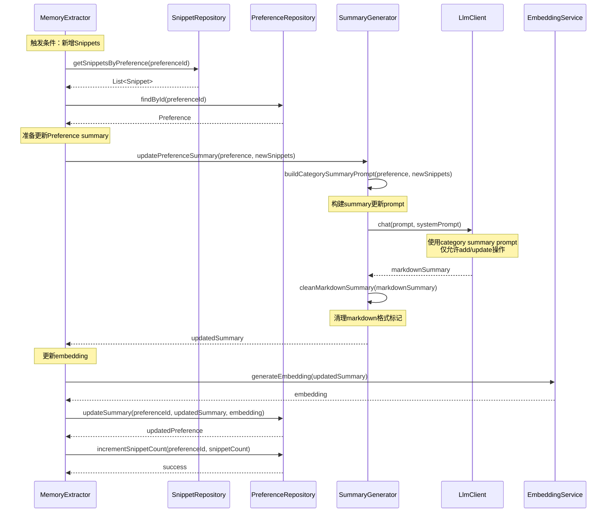

# Preference Summary更新流程

## 流程说明
基于memU的实现，将新提取的Snippets合并到现有Preference summary中，使用add/update操作，更新summary的embedding。

## 参与者
- MemoryExtractor: 记忆提取器
- PreferenceRepository: 偏好仓储
- SummaryGenerator: 摘要生成器
- LlmClient: 大语言模型客户端
- EmbeddingService: 向量化服务

## 时序图



## Prompt模板（基于memU）

### Category Summary更新Prompt
```markdown
# Task Objective
You are a professional User Profile Synchronization Specialist. Your core objective is to accurately merge newly extracted user information items into the user's initial profile using only two operations: add and update.

# Workflow
## Step 1: Preprocessing & Parsing
- Input sources:
  - User Initial Profile: structured, categorized, confirmed long-term user information.
  - Newly Extracted User Information Items: new information extracted from recent conversations.
- Structure parsing:
  - Initial profile: extract categories and core content; preserve original wording style and format.
  - New items: validate completeness and category correctness.

## Step 2: Core Operations (Update / Add)
### A. Update
- **Conflict detection**: compare new items with existing ones for semantic overlap.
- **Validity priority**: retain information that is more specific, clearer, and more certain.
- **Format consistency**: maintain the original format and style of the profile.

### B. Add
- **Deduplication check**: ensure the new item is not identical or semantically similar to existing items.
- **Category matching**: place the item into the correct predefined category.
- **Format alignment**: follow the existing category's format and style.

## Step 3: Summarize
Target length: {target_length}
Summarize the updated user markdown profile to the target length.

# User Initial Profile
```markdown
{existing_summary}
```

# Newly Extracted User Information Items
{new_memories}

# Output Requirements
## Format
- Output MUST be in valid Markdown format.
- Maintain the original structure: use `## Category Name` for category headers.
- Use bullet points for list items.

## Content Rules
- **Only use ADD and UPDATE operations**: DO NOT actively delete or remove information.
- **Preserve style**: keep the original wording style and format.
- **Control length**: the final summary should be around {target_length} words.
- **Avoid redundancy**: merge similar items and avoid repetition.
- **Fact-based**: only include information that is explicitly supported by the input.

## Output Format
```markdown
# {category_name}
## <category name>
- User information item
- Another user information item
...
```
```

### System Prompt
```markdown
You are a User Profile Synchronization Specialist. Your task is to merge new user information into an existing user profile.

IMPORTANT RULES:
1. You can ONLY use ADD and UPDATE operations. Never delete information.
2. Preserve the original profile's format and style.
3. Merge similar items to avoid redundancy.
4. Keep the summary concise and factual.
5. Output must be in valid Markdown format.
```

## 接口方法说明

### PreferenceRepository
- `findById(preferenceId)`: 根据ID获取偏好
- `updateSummary(preferenceId, summary, embedding)`: 更新偏好摘要和向量
- `incrementSnippetCount(preferenceId, count)`: 增加snippet计数

### SnippetRepository
- `getSnippetsByPreference(preferenceId)`: 获取偏好关联的所有snippet

### SummaryGenerator
- `updatePreferenceSummary(preference, newSnippets)`: 更新偏好摘要
- `buildCategorySummaryPrompt(preference, newSnippets)`: 构建更新prompt
- `cleanMarkdownSummary(markdownSummary)`: 清理markdown格式

### EmbeddingService
- `generateEmbedding(text)`: 生成文本向量

## Preference数据结构

```java
public class Preference {
    private String id;
    private String name;              // 分类名称，如"personal_info"
    private String description;       // 分类描述
    private String summary;           // 分类摘要（Markdown格式）
    private float[] embedding;        // 基于summary的向量
    private int snippetCount;        // 关联的snippet数量
    private double totalImportance;
    private long lastUpdated;

    // 默认分类（基于memU）
    public static final List<CategoryConfig> DEFAULT_CATEGORIES = Arrays.asList(
        new CategoryConfig("personal_info", "Personal information about the user"),
        new CategoryConfig("preferences", "User preferences, likes and dislikes"),
        new CategoryConfig("relationships", "Information about relationships with others"),
        new CategoryConfig("activities", "Activities, hobbies, and interests"),
        new CategoryConfig("goals", "Goals, aspirations, and objectives"),
        new CategoryConfig("experiences", "Past experiences and events"),
        new CategoryConfig("knowledge", "Knowledge, facts, and learned information"),
        new CategoryConfig("opinions", "Opinions, viewpoints, and perspectives"),
        new CategoryConfig("habits", "Habits, routines, and patterns"),
        new CategoryConfig("work_life", "Work-related information and professional life")
    );
}
```

## 更新策略

### 触发条件
1. **新增Snippet时**：当新的snippet被创建并关联到preference时
2. **定期更新**：配置的更新间隔时间到达时
3. **手动触发**：用户或系统主动要求更新preference summary时

### 更新频率控制
```java
public class PreferenceUpdateConfig {
    private long minUpdateIntervalMs = 300000;  // 最小更新间隔：5分钟
    private int minSnippetCount = 3;             // 最小snippet数量：至少3个新snippet才触发
    private int targetSummaryLength = 400;        // 目标summary长度：400词
}
```

### 去重和合并策略
1. **内容哈希去重**：使用`contentHash`检测完全相同的内容
2. **语义去重**：使用embedding相似度检测语义相似的内容
3. **合并策略**：保留更具体、更新、更可信的信息
