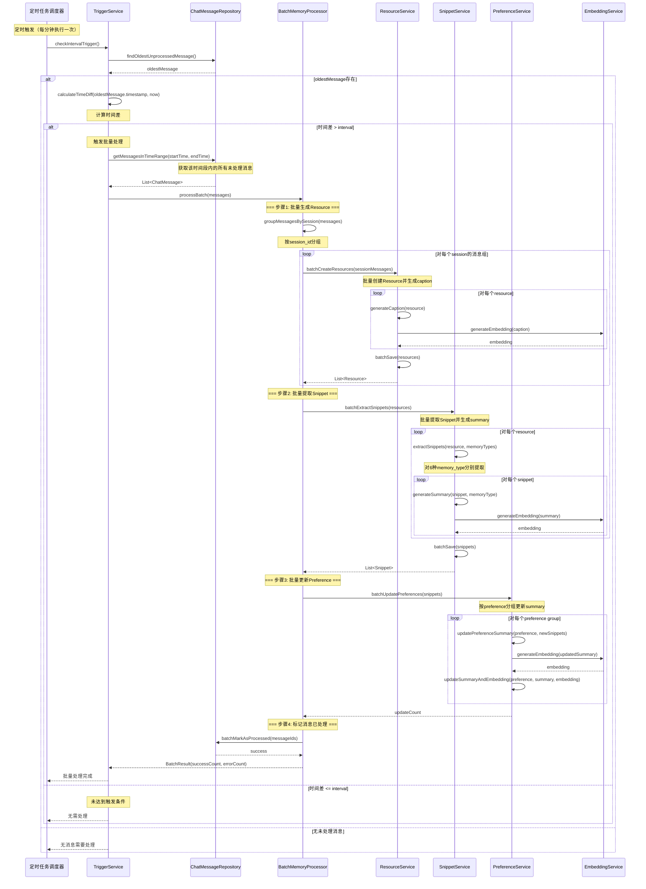

# Interval触发批量处理流程

## 流程说明
当检测到对话时间间隔超过配置的interval时，批量读取该时间段的对话，生成Resource、Snippet和Preference。

## 参与者
- 定时任务调度器
- TriggerService: 触发条件检查服务
- ChatMessageRepository: 对话消息仓储
- BatchMemoryProcessor: 批量记忆处理器
- ResourceService: 资源服务
- SnippetService: 记忆片段服务
- PreferenceService: 偏好服务
- EmbeddingService: 向量化服务

## 时序图



## 接口方法说明

### TriggerService
- `checkIntervalTrigger()`: 检查时间间隔触发条件
- `calculateTimeDiff(timestamp, now)`: 计算时间差

### ChatMessageRepository
- `findOldestUnprocessedMessage()`: 查找最旧的未处理消息
- `getMessagesInTimeRange(startTime, endTime)`: 获取时间段内的消息
- `batchMarkAsProcessed(messageIds)`: 批量标记消息为已处理

### BatchMemoryProcessor
- `processBatch(messages)`: 批量处理消息
- `groupMessagesBySession(messages)`: 按会话分组

### ResourceService
- `batchCreateResources(sessionMessages)`: 批量创建资源
- `generateCaption(resource)`: 生成资源描述
- `batchSave(resources)`: 批量保存资源

### SnippetService
- `batchExtractSnippets(resources)`: 批量提取记忆片段
- `extractSnippets(resource, memoryTypes)`: 从资源提取记忆片段
- `generateSummary(snippet, memoryType)`: 生成记忆摘要
- `batchSave(snippets)`: 批量保存记忆片段

### PreferenceService
- `batchUpdatePreferences(snippets)`: 批量更新偏好
- `updatePreferenceSummary(preference, newSnippets)`: 更新偏好摘要
- `updateSummaryAndEmbedding(preference, summary, embedding)`: 更新摘要和向量

## 配置参数

### TriggerConfig
```java
public class TriggerConfig {
    private long intervalMs = 300000;  // 5分钟：时间间隔阈值
    private int epochMax = 20;          // 最多累积20条对话
    private boolean autoTrigger = true;  // 是否自动触发
}
```

### BatchProcessConfig
```java
public class BatchProcessConfig {
    private int maxBatchSize = 100;           // 最大批量大小
    private int concurrentSessions = 5;        // 并发处理会话数
    private long processingTimeoutMs = 300000; // 处理超时时间
}
```

## 批量处理策略

### 资源分组
- 按session_id分组对话
- 每个session独立创建Resource
- 避免跨session的Resource

### 并发控制
- 限制并发处理的session数量
- 使用线程池控制并发度
- 避免系统资源耗尽

### 错误处理
- 单个Resource失败不影响其他Resource
- 记录失败原因用于重试
- 批量处理结果包含成功和失败计数

## 性能优化

### 向量化批处理
```java
// 批量生成embedding
List<String> texts = resources.stream()
    .map(Resource::getCaption)
    .collect(Collectors.toList());

List<float[]> embeddings = embeddingService.batchGenerate(texts);

// 批量更新
for (int i = 0; i < resources.size(); i++) {
    resources.get(i).setEmbedding(embeddings.get(i));
}
```

### LLM调用优化
```java
// 批量调用LLM生成summary
List<String> summaries = llmClient.batchGenerateSummaries(
    resources.stream()
        .map(Resource::getContent)
        .collect(Collectors.toList()),
    memoryType
);
```
