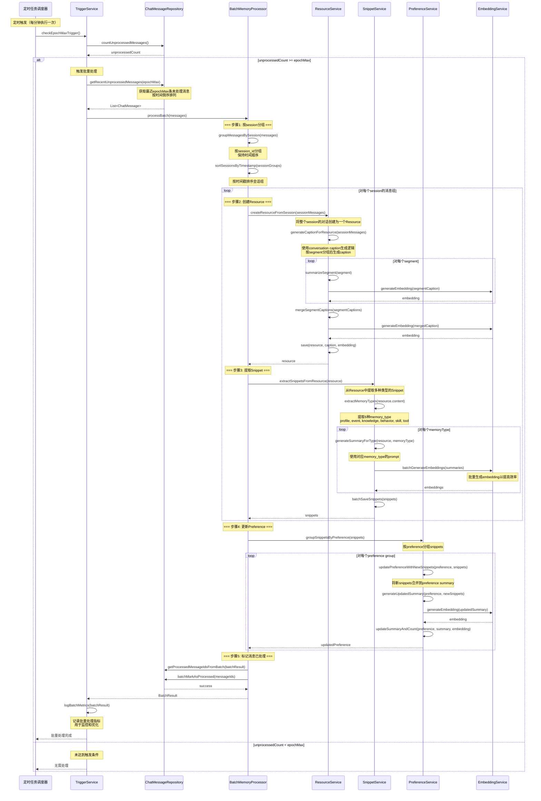

# EpochMax触发批量处理流程

## 流程说明
当未处理的对话数量超过epochMax阈值时，批量处理最近的epochMax条对话，生成Resource、Snippet和Preference。

## 参与者
- 定时任务调度器
- TriggerService: 触发条件检查服务
- ChatMessageRepository: 对话消息仓储
- BatchMemoryProcessor: 批量记忆处理器
- ResourceService: 资源服务
- SnippetService: 记忆片段服务
- PreferenceService: 偏好服务
- EmbeddingService: 向量化服务

## 时序图



## 接口方法说明

### TriggerService
- `checkEpochMaxTrigger()`: 检查对话数量触发条件
- `logBatchMetrics(batchResult)`: 记录批量处理指标

### ChatMessageRepository
- `countUnprocessedMessages()`: 统计未处理消息数量
- `getRecentUnprocessedMessages(epochMax)`: 获取最近epochMax条未处理消息
- `batchMarkAsProcessed(messageIds)`: 批量标记为已处理

### BatchMemoryProcessor
- `processBatch(messages)`: 批量处理消息
- `groupMessagesBySession(messages)`: 按会话分组
- `sortSessionsByTimestamp(sessionGroups)`: 按时间戳排序会话

### ResourceService
- `createResourceFromSession(sessionMessages)`: 从会话创建资源
- `generateCaptionForResource(sessionMessages)`: 为资源生成描述
- `summarizeSegment(segment)`: 总结对话片段
- `mergeSegmentCaptions(segmentCaptions)`: 合并片段描述

### SnippetService
- `extractSnippetsFromResource(resource)`: 从资源提取记忆片段
- `extractMemoryTypes(resource.content)`: 提取多种记忆类型
- `generateSummaryForType(resource, memoryType)`: 为特定类型生成摘要
- `batchSaveSnippets(snippets)`: 批量保存记忆片段

### PreferenceService
- `groupSnippetsByPreference(snippets)`: 按偏好分组片段
- `updatePreferenceWithNewSnippets(preference, snippets)**: 用新片段更新偏好
- `generateUpdatedSummary(preference, newSnippets)`: 生成更新后的摘要
- `updateSummaryAndCount(preference, summary, embedding)`: 更新摘要和计数

## 配置参数

### TriggerConfig
```java
public class TriggerConfig {
    private long intervalMs = 300000;  // 5分钟
    private int epochMax = 20;          // 最多累积20条对话
    private boolean autoTrigger = true;
}
```

### EpochConfig
```java
public class EpochConfig {
    private int segmentSize = 20;           // 对话分段大小
    private int maxResourcePerBatch = 50;    // 每批最大Resource数量
    private int maxSnippetPerResource = 30;  // 每个Resource最大Snippet数量
}
```

## 批量处理优化

### 对话分段策略
```java
// 将长对话分段处理
List<List<ChatMessage>> segments = new ArrayList<>();
List<ChatMessage> currentSegment = new ArrayList<>();

for (ChatMessage message : sessionMessages) {
    currentSegment.add(message);
    if (currentSegment.size() >= segmentSize) {
        segments.add(new ArrayList<>(currentSegment));
        currentSegment.clear();
    }
}

if (!currentSegment.isEmpty()) {
    segments.add(currentSegment);
}
```

### 批量向量化
```java
// 收集需要向量化的文本
List<String> textsToEmbed = new ArrayList<>();

// 收集所有segment captions
for (Segment segment : segments) {
    textsToEmbed.add(segment.getCaption());
}

// 批量生成embedding
List<float[]> embeddings = embeddingService.batchGenerate(textsToEmbed);

// 分配embedding
for (int i = 0; i < segments.size(); i++) {
    segments.get(i).setEmbedding(embeddings.get(i));
}
```

### 批量LLM调用
```java
// 批量提取snippets
Map<MemoryType, List<Snippet>> snippetsByType = new EnumMap<>(MemoryType.class);

for (MemoryType type : MemoryType.values()) {
    List<Snippet> snippets = snippetService.batchExtractForType(
        resource, type, batchSize
    );
    snippetsByType.put(type, snippets);
}
```

## 性能指标监控

### BatchMetrics
```java
public class BatchMetrics {
    private long startTime;
    private long endTime;
    private int totalMessages;
    private int totalResources;
    private int totalSnippets;
    private int totalPreferences;
    private int successCount;
    private int errorCount;
    private long llmCallCount;
    private long embeddingCallCount;
    private long processingTimeMs;

    public double getProcessingRate() {
        return (double) totalMessages / (processingTimeMs / 1000.0);
    }

    public double getAverageLlmTime() {
        return llmCallCount > 0 ? (double) llmCallTime / llmCallCount : 0;
    }
}
```

## 错误处理策略

### 部分失败处理
```java
public class BatchResult {
    private List<Resource> successResources;
    private List<ProcessingError> failedResources;
    private List<Snippet> successSnippets;
    private List<ProcessingError> failedSnippets;

    public boolean hasFailures() {
        return !failedResources.isEmpty() || !failedSnippets.isEmpty();
    }

    public String getErrorSummary() {
        // 生成错误摘要用于日志和监控
    }
}
```

### 重试策略
```java
public class RetryConfig {
    private int maxRetries = 3;                    // 最大重试次数
    private long retryDelayMs = 1000;               // 重试延迟
    private double backoffMultiplier = 2.0;         // 退避倍数
    private Set<String> retryableErrors = Set.of(
        "LLM_TIMEOUT",
        "EMBEDDING_TIMEOUT",
        "DATABASE_CONNECTION_ERROR"
    );
}
```
