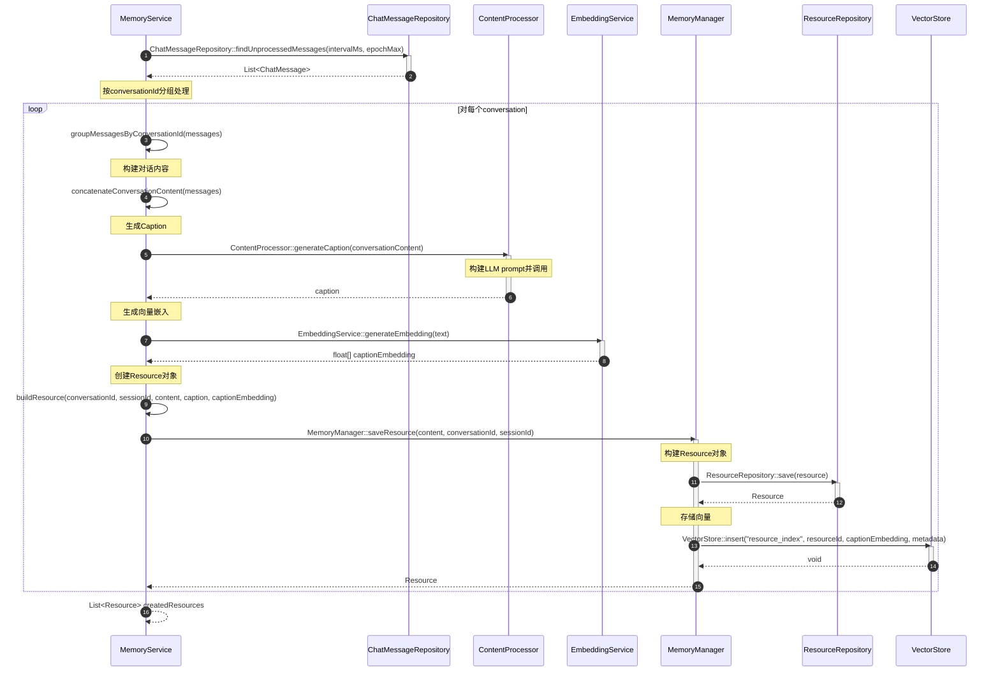

# ResourceCaption生成流程

## 流程说明

本流程描述了如何为对话资源生成caption。Caption是对话内容的简洁摘要，用于后续的向量检索和记忆关联。

## 时序图



## 关键接口说明

### ChatMessageRepository::findUnprocessedMessages
- **功能**：查找未处理的消息
- **参数**：
  - intervalMs: 时间间隔（毫秒）
  - epochMax: 消息数量阈值
- **返回**：List<ChatMessage> 未处理的消息列表

### ContentProcessor::generateCaption
- **功能**：为对话内容生成caption摘要
- **参数**：content 对话内容
- **返回**：caption文本（300-500字）
- **实现逻辑**：
  1. 构建LLM prompt
  2. 调用LLM生成摘要
  3. 返回caption

### EmbeddingService::generateEmbedding
- **功能**：生成文本的向量嵌入
- **参数**：text 待向量化的文本
- **返回**：float[] 向量数组
- **向量模型**：text-embedding-3-small（1536维）

### MemoryManager::saveResource
- **功能**：保存对话资源
- **参数**：
  - content: 对话内容
  - conversationId: 对话ID
  - sessionId: 会话ID
- **返回**：Resource对象
- **流程**：
  1. 创建Resource对象
  2. 保存到数据库
  3. 存储向量到VectorStore

### ResourceRepository::save
- **功能**：保存Resource到数据库
- **参数**：resource Resource对象
- **返回**：保存后的Resource对象（含ID）

### VectorStore::insert
- **功能**：插入向量数据
- **参数**：
  - indexName: 索引名称（resource_index）
  - id: Resource ID
  - vector: caption向量
  - metadata: 元数据（conversationId, sessionId, messageCount等）
- **返回**：void

## LLM Prompt设计

### Caption生成Prompt
```
请为以下对话内容生成一个简洁的摘要（caption），要求：

1. 长度：300-500字
2. 内容：
   - 概括对话的主要主题
   - 提及关键信息点
   - 突出用户的重要陈述
3. 风格：客观、简洁、易读
4. 不要包含对话的逐字记录

对话内容：
{conversationContent}

请生成caption：
```

## 数据模型

### Resource（简化版，仅对话）
```java
public class Resource {
    private String id;
    private String conversationId;      // 对话ID
    private String sessionId;           // 会话ID
    private String content;             // 原始对话内容
    private String caption;             // LLM生成的摘要
    private float[] embedding;          // 基于caption的向量
    private int messageCount;           // 消息数量
    private ResourceMetadata metadata;
    private ResourceStats stats;
    private long createdAt;
    private long updatedAt;
}
```

### ResourceMetadata
```java
public class ResourceMetadata {
    private String sessionId;
    private String conversationId;
    private int messageCount;
    private long firstMessageTime;
    private long lastMessageTime;
    private List<String> participantIds;
}
```

## 批处理优化

### 批量Caption生成
```java
// ContentProcessor接口支持批量处理
List<String> batchGenerateCaptions(List<String> contents);
```

### 批量向量化
```java
// EmbeddingService接口支持批量向量化
List<float[]> batchGenerateEmbeddings(List<String> texts);
```

### 批量存储
```java
// VectorStore接口支持批量插入
void bulkInsert(String indexName, List<VectorData> vectorDataList);
```

## 处理流程

### 单个对话处理
1. 获取对话消息
2. 拼接对话内容
3. 生成caption
4. 生成向量
5. 存储Resource
6. 存储向量

### 批量处理（优化）
1. 获取多个对话的消息
2. 批量拼接对话内容
3. 批量生成captions
4. 批量生成向量
5. 批量存储Resources
6. 批量存储向量

## 质量保证

### Caption质量检查
1. **长度检查**：300-500字
2. **内容检查**：包含关键信息
3. **格式检查**：文本格式正确
4. **去重检查**：与现有caption不重复

### 生成失败处理
1. **重试机制**：最多重试3次
2. **降级策略**：使用原始内容的前N字作为caption
3. **日志记录**：记录失败原因
4. **告警机制**：连续失败触发告警
