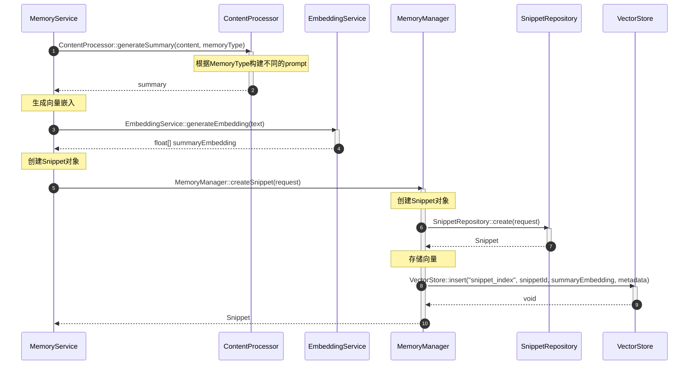

# SnippetSummary生成流程

## 流程说明

本流程描述了如何从对话内容中提取结构化记忆（Snippet）并生成summary。Snippet有6种类型（PROFILE, EVENT, KNOWLEDGE, BEHAVIOR, SKILL, TOOL），每种类型有特定的summary生成逻辑。

## 时序图



## 关键接口说明

### ContentProcessor::generateSummary
- **功能**：为特定类型的记忆生成结构化摘要
- **参数**：
  - content: 原始对话内容
  - memoryType: 记忆类型（PROFILE/EVENT/KNOWLEDGE/BEHAVIOR/SKILL/TOOL）
- **返回**：summary文本
- **实现逻辑**：
  1. 根据memoryType构建特定prompt
  2. 调用LLM生成结构化summary
  3. 返回summary

### EmbeddingService::generateEmbedding
- **功能**：生成文本的向量嵌入
- **参数**：text 待向量化的文本
- **返回**：float[] 向量数组

### MemoryManager::createSnippet
- **功能**：创建结构化记忆片段
- **参数**：SnippetCreateRequest 创建请求
- **返回**：Snippet对象
- **流程**：
  1. 创建Snippet对象
  2. 保存到数据库
  3. 存储向量到VectorStore

### SnippetRepository::create
- **功能**：创建Snippet
- **参数**：request SnippetCreateRequest
- **返回**：创建的Snippet对象

### VectorStore::insert
- **功能**：插入向量数据
- **参数**：
  - indexName: 索引名称（snippet_index）
  - id: Snippet ID
  - vector: summary向量
  - metadata: 元数据（memoryType, conversationId, sessionId等）
- **返回**：void

## 数据模型

### Snippet
```java
public class Snippet {
    private String id;
    private String resourceId;              // 关联的Resource ID
    private String conversationId;          // 对话ID
    private String sessionId;               // 会话ID
    private String content;                 // 原始内容
    private String summary;                 // LLM生成的摘要
    private MemoryType memoryType;          // 记忆类型
    private float[] embedding;              // 基于summary的向量
    private double importance;              // 重要性分数
    private List<String> preferenceIds;     // 关联的Preference ID列表
    private SnippetMetadata metadata;
    private SnippetStats stats;
    private long createdAt;
    private long updatedAt;
}
```

### MemoryType枚举
```java
public enum MemoryType {
    PROFILE,      // 用户个人信息
    EVENT,        // 事件信息
    KNOWLEDGE,    // 客观知识
    BEHAVIOR,     // 行为模式
    SKILL,        // 技能信息
    TOOL          // 工具使用
}
```

### SnippetCreateRequest
```java
public class SnippetCreateRequest {
    private String resourceId;
    private String conversationId;
    private String sessionId;
    private String content;
    private String summary;
    private MemoryType memoryType;
    private double importance;
    private List<String> preferenceIds;
    private Map<String, Object> metadata;
}
```

## 批处理优化

### 批量Summary生成
```java
// ContentProcessor接口支持批量处理
List<String> batchGenerateSummaries(List<String> contents, MemoryType memoryType);
```

### 批量创建Snippet
```java
// SnippetRepository接口支持批量创建
List<Snippet> createAll(List<SnippetCreateRequest> requests);
```

### 批量向量化
```java
// EmbeddingService接口支持批量向量化
List<float[]> batchGenerateEmbeddings(List<String> texts);
```

## 处理流程

### 单个Snippet处理
1. 确定memoryType
2. 生成summary
3. 生成向量
4. 创建Snippet
5. 存储向量

### 批量处理（优化）
1. 批量确定memoryType
2. 批量生成summaries
3. 批量生成向量
4. 批量创建Snippets
5. 批量存储向量

## 质量保证

### Summary质量检查
1. **类型匹配**：summary符合memoryType要求
2. **信息完整**：包含该类型的关键信息
3. **长度适当**：200-400字
4. **结构清晰**：易于理解和检索

### 生成失败处理
1. **重试机制**：最多重试3次
2. **类型切换**：尝试用其他类型提取
3. **降级策略**：使用原始内容摘要
4. **日志记录**：记录失败原因

## 与Preference的关联

Snippet创建后会关联到相关的Preference：
1. 自动关联：根据summary内容自动匹配Preference
2. 手动关联：用户指定关联关系
3. 动态关联：后续检索时动态建立关联
