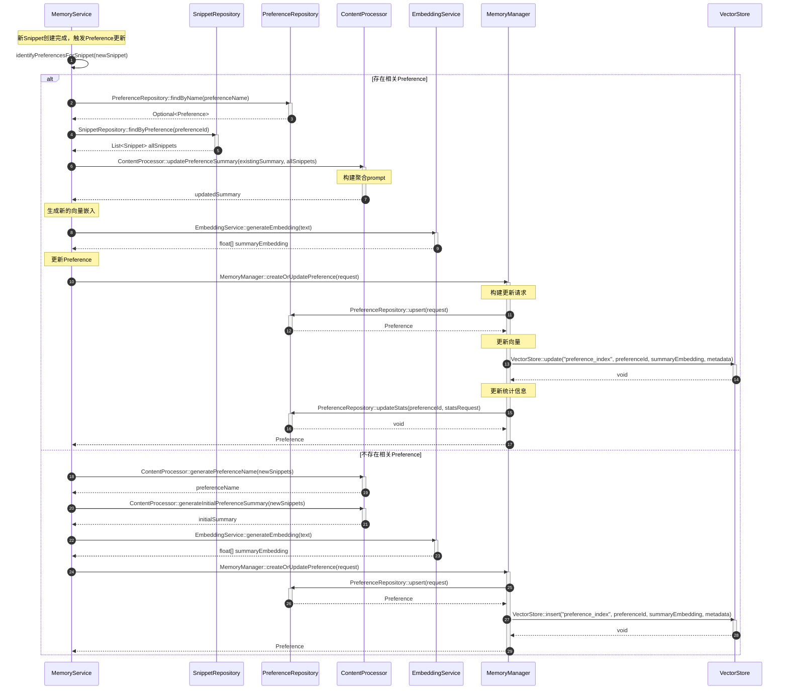

# PreferenceSummary更新流程

## 流程说明

本流程描述了如何更新Preference（偏好主题）的summary。Preference是多个Snippet的聚合摘要，当新的Snippet被创建时，需要更新相关Preference的summary。

## 时序图



## 关键接口说明

### ContentProcessor::updatePreferenceSummary
- **功能**：更新偏好总结，聚合新的Snippet
- **参数**：
  - existingSummary: 现有偏好总结
  - newSnippets: 新的Snippet列表（包含所有相关Snippet）
- **返回**：更新后的偏好总结

### ContentProcessor::generatePreferenceName
- **功能**：从Snippet列表中提取主题名称
- **参数**：snippets Snippet列表
- **返回**：preferenceName 主题名称

### ContentProcessor::generateInitialPreferenceSummary
- **功能**：生成初始Preference summary
- **参数**：snippets Snippet列表
- **返回**：initialSummary 初始总结

### EmbeddingService::generateEmbedding
- **功能**：生成文本的向量嵌入
- **参数**：text 待向量化的文本
- **返回**：float[] 向量数组

### MemoryManager::createOrUpdatePreference
- **功能**：创建或更新偏好主题
- **参数**：PreferenceCreateRequest 创建请求
- **返回**：Preference对象

### PreferenceRepository::upsert
- **功能**：创建或更新Preference（原子操作）
- **参数**：request PreferenceCreateRequest
- **返回**：Preference对象

### PreferenceRepository::updateStats
- **功能**：更新Preference统计信息
- **参数**：
  - preferenceId: Preference ID
  - request: PreferenceUpdateStatsRequest
- **返回**：void

### SnippetRepository::findByPreference
- **功能**：根据Preference ID查找所有关联的Snippet
- **参数**：preferenceId Preference ID
- **返回**：List<Snippet> Snippet列表

### VectorStore::update
- **功能**：更新向量数据
- **参数**：
  - indexName: 索引名称（preference_index）
  - id: Preference ID
  - vector: 新的summary向量
  - metadata: 新的元数据
- **返回**：void

### VectorStore::insert
- **功能**：插入新向量数据
- **参数**：
  - indexName: 索引名称（preference_index）
  - id: Preference ID
  - vector: summary向量
  - metadata: 元数据
- **返回**：void

## 数据模型

### Preference
```java
public class Preference {
    private String id;
    private String name;                   // 主题名称
    private String summary;                // LLM聚合的摘要
    private float[] embedding;             // 基于summary的向量
    private int snippetCount;              // 关联的Snippet数量
    private double importance;             // 重要性分数
    private List<String> snippetIds;       // 关联的Snippet ID列表
    private PreferenceMetadata metadata;
    private PreferenceStats stats;
    private long createdAt;
    private long updatedAt;
    private long lastAccessTime;
}
```

### PreferenceCreateRequest
```java
public class PreferenceCreateRequest {
    private String name;
    private String summary;
    private float[] embedding;
    private List<String> snippetIds;
    private double importance;
    private Map<String, Object> metadata;
}
```

### PreferenceUpdateStatsRequest
```java
public class PreferenceUpdateStatsRequest {
    private String preferenceId;
    private int snippetCount;              // 新的Snippet数量
    private double importance;             // 新的重要性分数
    private long lastAccessTime;           // 最后访问时间
}
```

## 处理流程

### 更新现有Preference
1. 查找相关Preference
2. 获取所有关联Snippets
3. 聚合生成新summary
4. 更新向量
5. 更新统计信息

### 创建新Preference
1. 提取Preference名称
2. 生成初始summary
3. 生成向量
4. 创建Preference
5. 关联Snippets

## 批处理优化

### 批量更新Preferences
```java
// PreferenceRepository接口支持批量更新
void updateStatsAll(List<PreferenceUpdateStatsRequest> requests);
```

### 批量生成Preference Summaries
```java
// ContentProcessor接口支持批量处理
List<String> batchUpdatePreferenceSummaries(
    List<String> existingSummaries,
    List<List<Snippet>> newSnippets
);
```

## 质量保证

### Summary质量检查
1. **信息完整**：包含所有关键Snippet信息
2. **连贯性**：逻辑连贯，不矛盾
3. **长度适当**：400-600字
4. **更新及时**：反映最新信息

### 更新策略
1. **增量更新**：每次新Snippet加入时更新
2. **定期重构**：定期完全重新聚合（可选）
3. **重要性衰减**：旧信息权重降低（可选）

### 失败处理
1. **重试机制**：最多重试3次
2. **版本控制**：保留旧版本summary
3. **降级策略**：保留现有summary不变
4. **日志记录**：记录失败原因

## 统计信息更新

### PreferenceStats
```java
public class PreferenceStats {
    private int snippetCount;              // Snippet数量
    private double avgImportance;          // 平均重要性
    private long lastSnippetTime;          // 最后Snippet时间
    private long totalAccessCount;         // 总访问次数
    private double accessFrequency;        // 访问频率
}
```

### 更新时机
1. 新Snippet关联时
2. Preference被访问时
3. 定期统计更新时
