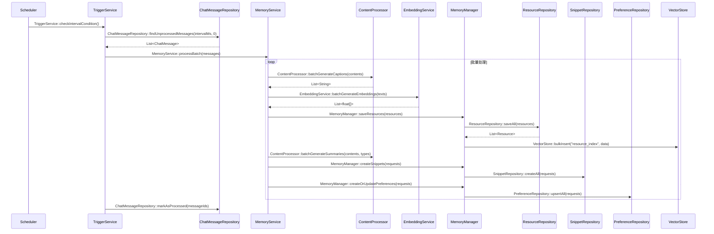

# 06-Interval触发批量处理 - 简化版

## 核心流程

## 关键接口

### ChatMessageRepository
- findUnprocessedMessages(intervalMs, epochMax)
- markAsProcessed(messageIds)

### ContentProcessor
- batchGenerateCaptions(contents)
- batchGenerateSummaries(contents, memoryTypes)

### EmbeddingService
- batchGenerateEmbeddings(texts)

### VectorStore
- bulkInsert(indexName, vectorDataList)

### MemoryService
- processBatch(messages)

### MemoryManager
- saveResources(resources)
- createSnippets(requests)
- createOrUpdatePreferences(requests)
