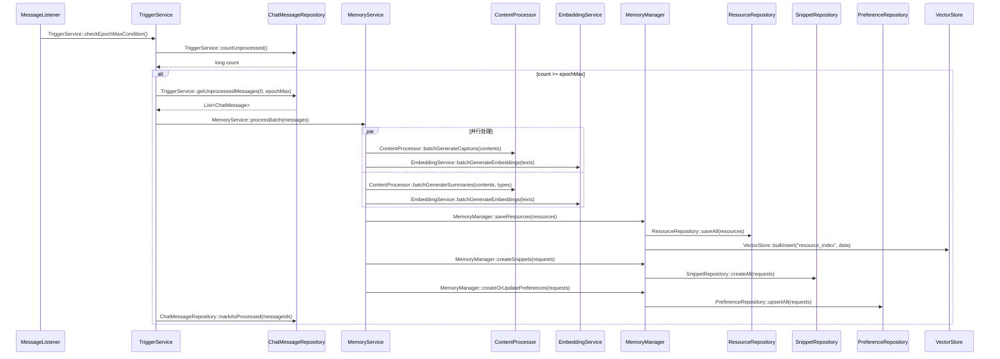

# 07-EpochMax触发批量处理 - 简化版

## 核心流程

## 关键接口

### TriggerService
- checkEpochMaxCondition()
- getUnprocessedMessages(intervalMs, epochMax)
- countUnprocessed()

### ChatMessageRepository
- findUnprocessedMessages(intervalMs, epochMax)
- markAsProcessed(messageIds)
- countUnprocessed()

### 其他接口同06号文件
