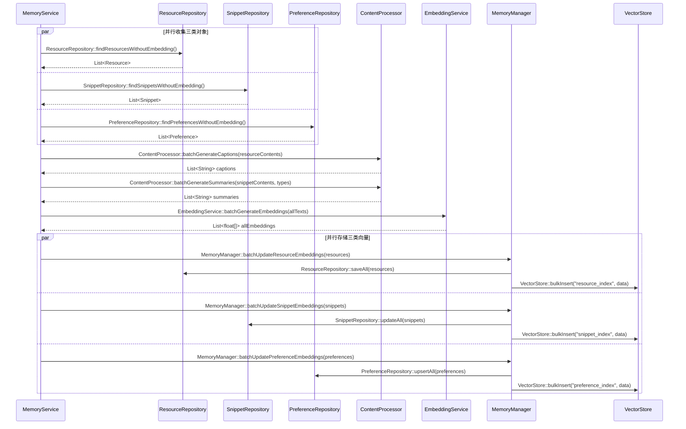

# 08-向量化批处理 - 简化版

## 核心流程

## 关键接口

### ContentProcessor
- batchGenerateCaptions(contents)
- batchGenerateSummaries(contents, memoryTypes)

### EmbeddingService
- batchGenerateEmbeddings(texts)

### VectorStore
- bulkInsert(indexName, vectorDataList)

### MemoryManager
- batchUpdateResourceEmbeddings(resources)
- batchUpdateSnippetEmbeddings(snippets)
- batchUpdatePreferenceEmbeddings(preferences)

### Repository (假设需补充)
- findResourcesWithoutEmbedding()
- findSnippetsWithoutEmbedding()
- findPreferencesWithoutEmbedding()
