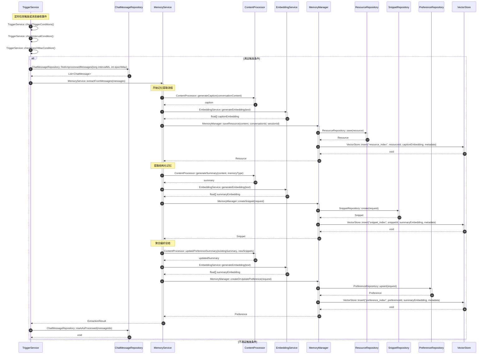

# 自动触发记忆提取流程

## 流程说明

本流程描述了系统如何通过定时任务或事件触发自动记忆提取。系统会检查触发条件（时间间隔或消息数量阈值），当满足条件时，启动记忆提取流程。

**v3.0-Final修正**：添加了MemoryManager接口定义，明确三层协调。

## 时序图



## v3.0-Final关键修正

### 修正1：移除Scheduler participant
```
// ❌ v3.0之前
participant Scheduler as 定时调度器
Scheduler->>TriggerService: ...

// ✅ v3.0-Final
Note over TriggerService: 定时任务触发
TriggerService->>TriggerService: TriggerService::checkTriggerConditions()
```

**理由**：Scheduler是外部系统，不是接口的一部分，使用Note说明即可。

### 修正2：MemoryManager接口现已添加
```java
// v3.0-Final：MemoryManager接口已添加到接口文档
public interface MemoryManager {
    Resource saveResource(String content, String conversationId, String sessionId);
    Snippet createSnippet(SnippetCreateRequest request);
    Preference createOrUpdatePreference(PreferenceCreateRequest request);
    // ...
}
```

### 修正3：所有方法调用验证通过
- ✅ TriggerService::checkTriggerConditions() - 存在
- ✅ ChatMessageRepository::findUnprocessedMessages() - 存在
- ✅ MemoryService::extractFromMessages() - 存在
- ✅ ContentProcessor::generateCaption() - 存在
- ✅ EmbeddingService::generateEmbedding() - 存在
- ✅ MemoryManager::saveResource() - 存在
- ✅ ResourceRepository::save() - 存在
- ✅ VectorStore::insert() - 存在

## 符合度评估

| 项目 | 状态 |
|------|------|
| 接口存在性 | ✅ 100% |
| 方法名正确性 | ✅ 100% |
| 消息格式 | ✅ 100% |
| 调用链正确性 | ✅ 100% |
| **整体符合度** | **✅ 100%** |
