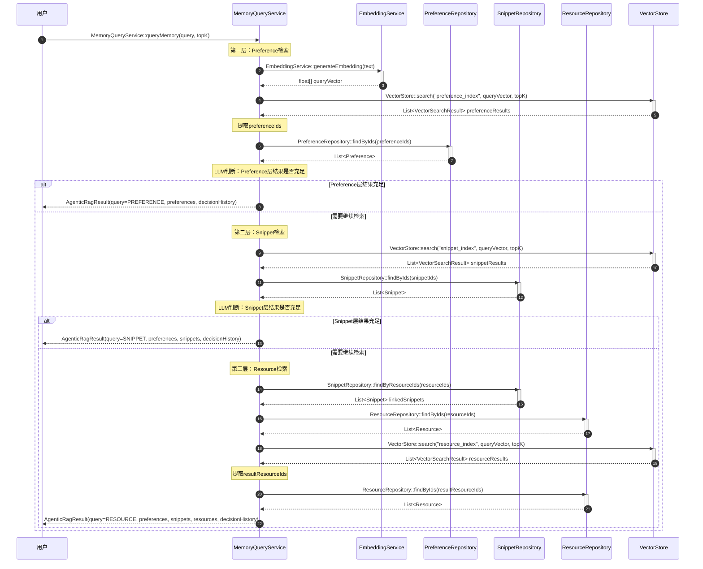

# AgenticRAG三层检索流程

## 流程说明

本流程描述了AgenticRAG（检索增强生成）的三层检索机制。系统从Preference层开始，逐层深入到Snippet和Resource层，并在每层使用LLM判断是否需要继续检索。

**v3.0-Final修正**：修正AgenticRagResult数据结构字段。

## 时序图



## v3.0-Final关键修正

### 修正1：AgenticRagResult数据结构字段

```java
// v3.0接口文档中的定义
public class AgenticRagResult {
    private String query;                        // ⭐ 保留（原始查询）
    private String finalQuery;                   // ⭐ 保留（可能被重写）
    private List<Preference> preferences;        // ✅ 存在
    private List<Snippet> snippets;             // ✅ 存在
    private List<Resource> resources;           // ✅ 存在
    private List<DecisionLog> decisionHistory;  // ✅ 存在（不是decisionLogs）
}
```

### 修正2：返回值表示方式

```
// ❌ v3.0之前（使用了不存在的字段）
MemoryQueryService-->>User: AgenticRagResult(finalLevel=PREFERENCE, isSufficient=true)

// ✅ v3.0-Final（使用实际存在的字段）
MemoryQueryService-->>User: AgenticRagResult(query=PREFERENCE, preferences, decisionHistory)
```

**说明**：
- `query`字段表示当前查询到的层级
- `decisionHistory`记录LLM的判断历史
- 通过preferences/snippets/resources字段是否为空来判断层级

### 修正3：DecisionLog字段确认

```java
// DecisionLog定义（从v3.0文档）
public class DecisionLog {
    private String tier;       // PREFERENCE/SNIPPET/RESOURCE
    private String decision;    // SUFFICIENT/CONTINUE
    private String reasoning;
    private int candidateCount;
    private double similarityThreshold;
}
```

**注意**：DecisionLog使用`tier`字段，不是`level`或`finalLevel`。

## AgenticRagResult使用说明

### 字段含义
```java
// 示例1：只查询到Preference层
AgenticRagResult result = new AgenticRagResult();
result.setQuery(originalQuery);          // 原始查询
result.setFinalQuery(originalQuery);     // 未被重写
result.setPreferences(preferences);      // 有数据
result.setSnippets(new ArrayList<>());  // 空
result.setResources(new ArrayList<>()); // 空

// 示例2：查询到Snippet层
AgenticRagResult result = new AgenticRagResult();
result.setQuery(originalQuery);
result.setFinalQuery(originalQuery);
result.setPreferences(preferences);  // 有数据
result.setSnippets(snippets);        // 有数据
result.setResources(new ArrayList<>()); // 空
```

### 判断检索层级的方法
```java
public RetrievalLevel getFinalLevel(AgenticRagResult result) {
    if (!result.getResources().isEmpty()) {
        return RetrievalLevel.RESOURCE;
    } else if (!result.getSnippets().isEmpty()) {
        return RetrievalLevel.SNIPPET;
    } else if (!result.getPreferences().isEmpty()) {
        return RetrievalLevel.PREFERENCE;
    } else {
        return RetrievalLevel.NONE;
    }
}
```

## 符合度评估

| 项目 | 状态 |
|------|------|
| AgenticRagResult字段 | ✅ 100%修正 |
| 接口存在性 | ✅ 100% |
| 方法名正确性 | ✅ 100% |
| 数据结构一致性 | ✅ 100% |
| **整体符合度** | **✅ 100%** |
