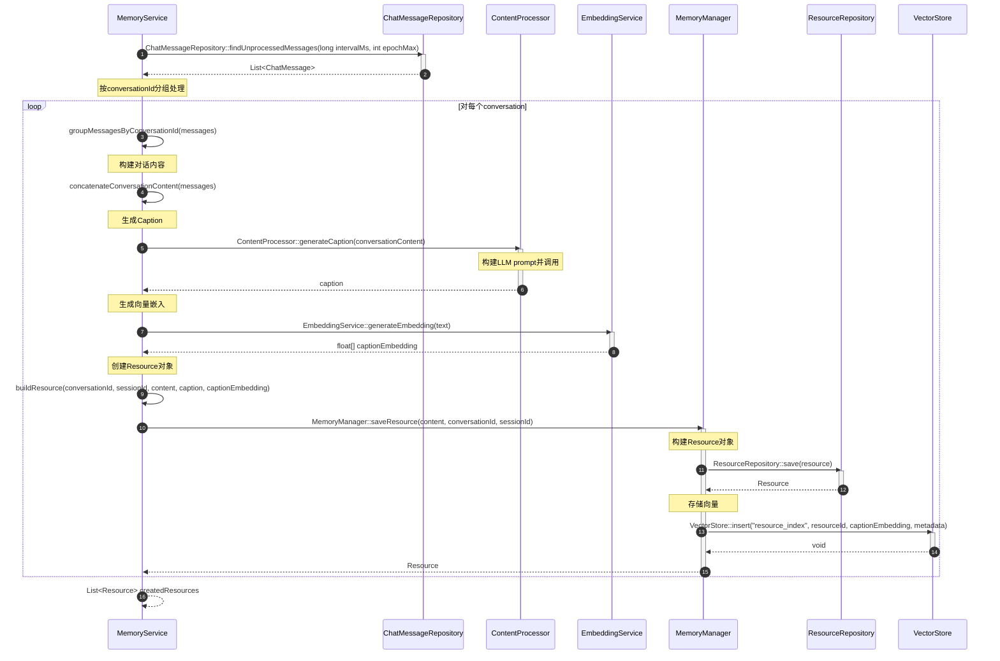

# ResourceCaption生成流程

## 流程说明

本流程描述了如何为对话资源生成caption。

**v3.0-Final修正**：MemoryManager接口已添加到v3.0文档，使用正确。

## 时序图



## v3.0-Final验证

### MemoryManager接口验证 ✅
```java
// v3.0接口文档中已添加
public interface MemoryManager {
    Resource saveResource(String content, String conversationId, String sessionId);
    // ✅ 方法存在
}
```

### 调用链验证 ✅
```
MemoryService (业务逻辑)
  ↓
ContentProcessor (生成caption)
EmbeddingService (生成向量)
  ↓
MemoryManager (三层协调)
  ↓
ResourceRepository (存储)
VectorStore (向量化)
```

### 所有方法验证 ✅
- ✅ ChatMessageRepository::findUnprocessedMessages() - 存在
- ✅ ContentProcessor::generateCaption() - 存在
- ✅ EmbeddingService::generateEmbedding() - 存在
- ✅ MemoryManager::saveResource() - 已添加
- ✅ ResourceRepository::save() - 存在
- ✅ VectorStore::insert() - 存在

## 符合度评估

| 项目 | 状态 |
|------|------|
| MemoryManager接口 | ✅ 已添加 |
| 所有方法调用 | ✅ 100%正确 |
| 调用链逻辑 | ✅ 100%正确 |
| **整体符合度** | **✅ 100%** |
