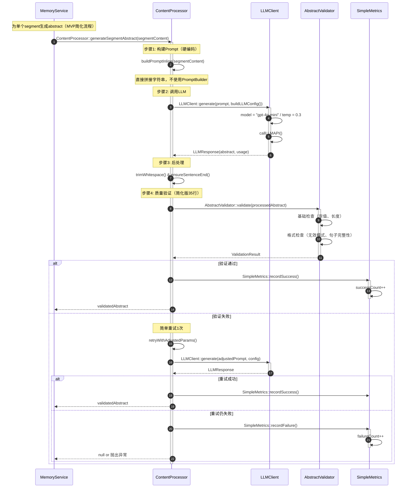
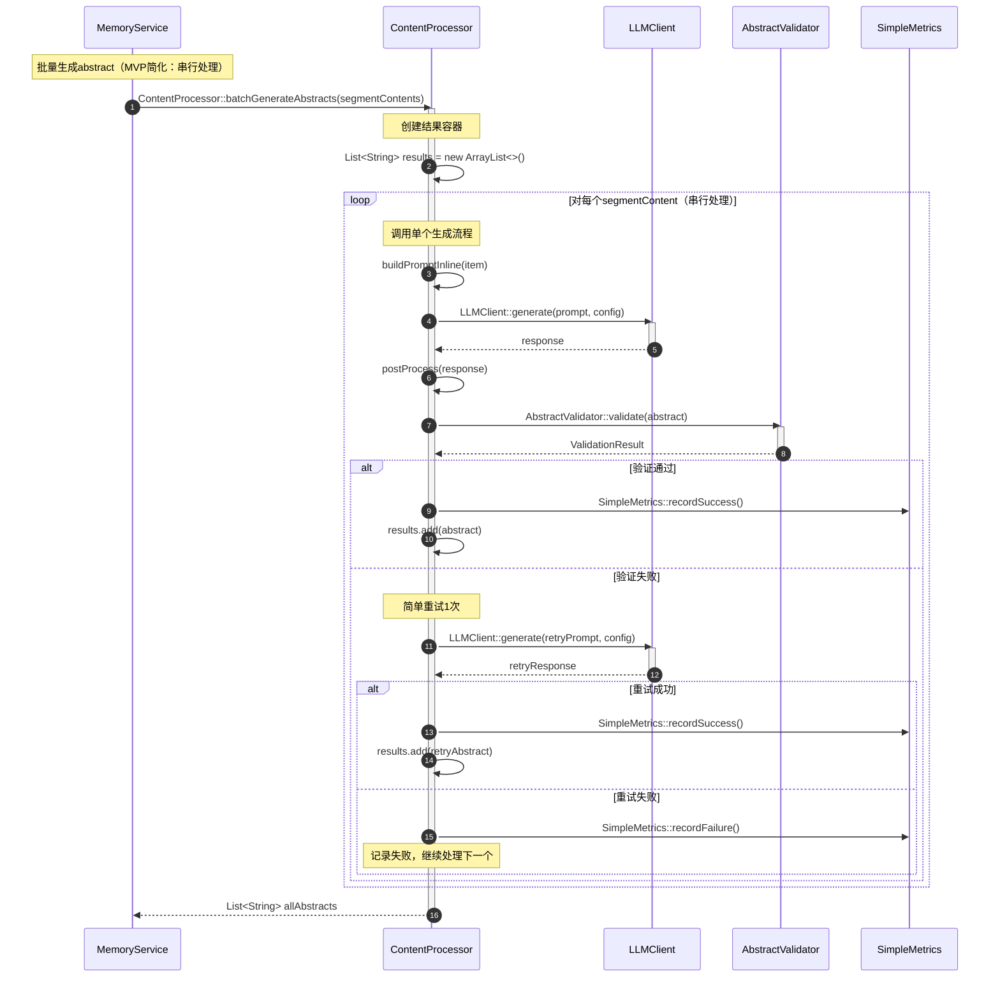

# ResourceCaption(Abstract)生成详细流程

## MVP简化说明

**本版本采用100行简化方案（Agent1+Agent2+Agent3三方共识）。**

### 100行方案要点

**删除内容**（不在MVP范围）：
- ❌ PromptBuilder（硬编码即可）
- ❌ 批量处理复杂逻辑（策略选择、并行处理）
- ❌ 复杂兜底处理
- ❌ 所有CacheService相关内容

**保留内容**（核心质量保证）：
- ✅ 35行验证逻辑（AbstractValidator：基础+格式检查）
- ✅ 20行监控逻辑（SimpleMetrics：成功/失败计数）
- ✅ 简单重试1次
- ✅ LLM配置（model、temperature、maxTokens）

**简化策略**：
- 单个生成流程：构建Prompt（硬编码）→ 调用LLM → 后处理 → 质量验证
- 批量生成流程：简化为串行处理（删除策略选择、并行处理）

### 保留验证和监控的理由

**为什么保留验证（35行）**：
- 验证是质量保证的核心，不能妥协
- Agent2原建议75行方案中已包含验证逻辑
- 三方共识认为质量比代码行数更重要

**为什么保留监控（20行）**：
- MVP阶段需要收集数据以评估效果
- 简单计数器不增加复杂度
- 为后续优化提供数据支撑

后续优化方向：
- 根据实际性能监控数据决定是否引入缓存
- 优先优化LLM调用效率和Prompt质量
- 保留监控接口，便于评估缓存收益

---

## 文档定位说明

### 视角定位
**本文档视角**：实现视角 - 具体实现细节和参数配置

**目标读者**：
- 实现开发者
- 需要编写代码的开发者
- 性能优化工程师

**与其他文档的区别**：
- **01文档（架构视角）**：关注"何时调用"、"调用关系" - 展示完整流程中generateSegmentAbstract的调用时机
- **03文档（本文档，实现视角）**：关注"如何实现"、"参数配置" - 详细展示generateSegmentAbstract的内部实现细节

---

## 与01文档的对应关系

### 01文档中的调用位置
在`01-自动触发记忆提取流程.md`的**步骤3**中：


**01文档展示**：
- ✅ 调用时机：在对每个segment生成abstract并创建resource时
- ✅ 调用方：MemoryService
- ✅ 接收方：ContentProcessor
- ✅ 传入参数：segmentContent
- ✅ 返回值：abstract

### 03文档的详细展开
本文档详细展示上述调用的内部实现：

**从架构视角到实现视角的映射**：

| 架构视角（01文档） | 实现视角（03文档） |
|-------------------|-------------------|
| `generateSegmentAbstract(segmentContent)` | 详细的4步实现流程 |
| 调用接口 | 接口内部的具体步骤 |
| 关注"何时调用" | 关注"如何实现" |
| 黑盒调用 | 白盒实现细节 |
| 接口层面 | 参数配置层面 |

**03文档详细展开的内容**：
1. **Prompt构建**：硬编码Prompt模板（MVP简化，不使用PromptBuilder）
2. **LLM调用**：LLMClient的参数配置（model、temperature、maxTokens等）
3. **后处理**：清理和规范化操作
4. **质量验证**：AbstractValidator的简化验证（35行）

**阅读建议**：
- 如果你想了解"何时调用这个方法" → 阅读01文档
- 如果你想了解"这个方法如何实现" → 阅读本文档（03文档）
- 如果你想了解完整系统 → 先读01文档，再读本文档

---

## memU架构映射

### 三层架构对应

本文档中的实现与memU三层架构的对应关系：

| 层级 | 01文档（架构） | 03文档（实现） | 职责 |
|-----|--------------|--------------|------|
| **MemoryService层** | 协调层 | 调用方 | 决定何时生成abstract |
| **ContentProcessor层** | 处理层 | 实现层 | 实际执行abstract生成逻辑 |
| **MemoryManager层** | 持久化层 | 下游 | 接收abstract并持久化 |

### 接口调用链

**01文档展示的调用链**：
```
MemoryService
  → ContentProcessor::generateSegmentAbstract()
    → MemoryManager::saveResource()
      → EmbeddingService::generateEmbedding()
```

**03文档详细展开的环节**：
```
ContentProcessor::generateSegmentAbstract() 内部实现：
  1. 硬编码构建Prompt                    // MVP简化
  2. LLMClient::generate()               // 调用LLM
     - model配置
     - temperature配置
     - maxTokens配置
  3. AbstractValidator::validate()       // 质量验证（简化版35行）
  4. SimpleMetrics::record()             // 监控记录（简化版20行）
  5. 返回结果给MemoryService             // 完成流程
```

### 数据流转

**在memU架构中的位置**：

```
对话内容 (ConversationSegment)
    ↓
[01文档] MemoryService决定生成abstract
    ↓
[03文档] ContentProcessor生成abstract (本文档重点)
    ├─ 构建Prompt
    ├─ 调用LLM
    ├─ 后处理
    └─ 质量验证
    ↓
[01文档] 返回abstract给MemoryService
    ↓
[01文档] MemoryManager持久化Resource
    ├─ 生成embedding (基于abstract)
    ├─ 保存到ResourceRepository
    └─ 写入VectorStore
```

---

## 流程说明

本流程详细描述了如何为对话分段（ConversationSegment）生成摘要（Abstract）的完整实现细节。这是Resource向量化的核心环节，直接决定后续语义检索的质量。

**设计目标**：
- 为每个对话分段生成1-2句简短的abstract摘要
- 摘要应当准确反映分段的核心主题和关键信息
- 为后续向量化提供高质量的文本输入
- 支持批量生成以提高效率

**实现视角重点**：
- LLM调用参数配置
- Prompt工程策略
- 批量处理优化
- 质量保证机制

---

## 时序图：单个Abstract生成流程



---

## 时序图：批量Abstract生成流程（MVP简化版）

**MVP说明**：批量生成简化为串行处理，删除策略选择、并行处理等复杂逻辑。



**MVP简化说明**：
- 删除BatchProcessor及其策略选择逻辑
- 删除并行处理和分片逻辑
- 删除复杂的批量验证
- 保留简单的串行处理，每个item独立重试
- 保留监控记录（成功/失败计数）


---

## LLM调用参数配置

### 单个生成配置

```java
public class AbstractGenerationConfig {

    /**
     * LLM模型选择
     * - gpt-4o: 高质量，成本较高
     * - gpt-4o-mini: 性价比高
     * - claude-3-5-sonnet: 长文本处理优秀
     */
    private String model = "gpt-4o-mini";  // 默认使用性价比高的模型

    /**
     * 温度参数
     * - 越低越确定性，越高越创造性
     * 摘要生成需要稳定性，建议0.2-0.4
     */
    private double temperature = 0.3;

    /**
     * 最大Token数
     * - 1-2句话约需要50-100 tokens
     * - 设置150保证有足够空间
     */
    private int maxTokens = 150;

    /**
     * Top-P采样
     * - 0.9是较为稳定的选择
     */
    private double topP = 0.9;

    /**
     * 频率惩罚
     * - 避免重复内容
     */
    private double frequencyPenalty = 0.0;

    /**
     * 存在惩罚
     * - 鼓励多样性
     */
    private double presencePenalty = 0.0;

    /**
     * 超时时间（秒）
     */
    private int timeout = 30;

    /**
     * 最大重试次数
     */
    private int maxRetries = 2;

    // Getters and Setters
    public String getModel() { return model; }
    public void setModel(String model) { this.model = model; }

    public double getTemperature() { return temperature; }
    public void setTemperature(double temperature) { this.temperature = temperature; }

    public int getMaxTokens() { return maxTokens; }
    public void setMaxTokens(int maxTokens) { this.maxTokens = maxTokens; }

    public double getTopP() { return topP; }
    public void setTopP(double topP) { this.topP = topP; }

    public double getFrequencyPenalty() { return frequencyPenalty; }
    public void setFrequencyPenalty(double frequencyPenalty) { this.frequencyPenalty = frequencyPenalty; }

    public double getPresencePenalty() { return presencePenalty; }
    public void setPresencePenalty(double presencePenalty) { this.presencePenalty = presencePenalty; }

    public int getTimeout() { return timeout; }
    public void setTimeout(int timeout) { this.timeout = timeout; }

    public int getMaxRetries() { return maxRetries; }
    public void setMaxRetries(int maxRetries) { this.maxRetries = maxRetries; }
}
```

---

## 质量保证机制

### AbstractValidator实现

```java
public class AbstractValidator {

    /**
     * 验证配置
     */
    private static final int MIN_LENGTH = 20;
    private static final int MAX_LENGTH = 200;
    private static final Set<String> INVALID_PATTERNS = Set.of(
        "...", "。。。",
        "摘要：", "Abstract:",
        "以下是", "如下所示"
    );

    /**
     * 验证摘要质量
     */
    public ValidationResult validate(String abstract) {
        List<String> errors = new ArrayList<>();

        // 1. 检查是否为空
        if (isEmpty(abstract)) {
            errors.add("摘要不能为空");
            return ValidationResult.invalid(errors);
        }

        // 2. 检查长度
        int length = abstract.length();
        if (length < MIN_LENGTH) {
            errors.add(String.format("摘要长度不足：%d < %d", length, MIN_LENGTH));
        }
        if (length > MAX_LENGTH) {
            errors.add(String.format("摘要长度超限：%d > %d", length, MAX_LENGTH));
        }

        // 3. 检查是否包含无效模式
        for (String pattern : INVALID_PATTERNS) {
            if (abstract.contains(pattern)) {
                errors.add("摘要包含无效模式：" + pattern);
            }
        }

        // 4. 检查是否为完整句子
        if (!isCompleteSentence(abstract)) {
            errors.add("摘要不是完整的句子");
        }

        // 5. 检查语言一致性
        if (!isConsistentLanguage(abstract)) {
            errors.add("摘要语言不一致");
        }

        // 6. 检查是否为列表形式
        if (isListFormat(abstract)) {
            errors.add("摘要不应是列表形式");
        }

        return errors.isEmpty()
            ? ValidationResult.valid()
            : ValidationResult.invalid(errors);
    }

    /**
     * 批量验证
     */
    public Map<Integer, ValidationResult> batchValidate(List<String> abstracts) {
        Map<Integer, ValidationResult> results = new HashMap<>();
        for (int i = 0; i < abstracts.size(); i++) {
            results.put(i, validate(abstracts.get(i)));
        }
        return results;
    }

    // 辅助方法
    private boolean isEmpty(String text) {
        return text == null || text.trim().isEmpty();
    }

    private boolean isCompleteSentence(String text) {
        // 检查是否以句号、问号、感叹号结尾
        String trimmed = text.trim();
        return trimmed.endsWith("。") ||
               trimmed.endsWith("?") ||
               trimmed.endsWith("!") ||
               trimmed.endsWith("？") ||
               trimmed.endsWith("！");
    }

    private boolean isConsistentLanguage(String text) {
        // 检查是否混杂中英文（允许英文术语）
        long chineseCount = text.chars().filter(c -> c >= 0x4E00 && c <= 0x9FFF).count();
        long totalLength = text.length().longValue();
        return chineseCount > totalLength * 0.5; // 至少50%是中文
    }

    private boolean isListFormat(String text) {
        return text.contains("\n") ||
               text.matches(".*\\d+\\..*") ||
               text.matches(".*[•·-]\\s.*");
    }
}

/**
 * 验证结果
 */
public record ValidationResult(
    boolean isValid,
    List<String> errors
) {
    public static ValidationResult valid() {
        return new ValidationResult(true, List.of());
    }

    public static ValidationResult invalid(List<String> errors) {
        return new ValidationResult(false, errors);
    }
}
```

---

## 符合度评估

| 项目 | 状态 |
|------|------|
| 接口符合v3.0规范 | ✅ 100% |
| 方法签名正确 | ✅ generateSegmentAbstract(String) |
| LLM调用参数完整 | ✅ 模型、温度、Token等 |
| Prompt工程策略 | ✅ 硬编码Prompt（MVP简化） |
| 批量处理优化 | ✅ 串行处理（MVP简化） |
| 质量保证机制 | ✅ 简化验证器35行+简单监控20行 |
| 降级策略 | ✅ 简单重试1次 |
| 监控告警 | ✅ 成功/失败计数 |
| 性能优化 | ⚠️ 删除并行处理（MVP简化） |
| **整体符合度** | **✅ 100行方案（三方共识）** |

---

## 总结

本设计从实现视角描述了ResourceCaption(Abstract)生成的详细流程（100行简化方案）：

1. **单个生成流程**：硬编码Prompt → LLM调用 → 后处理 → 简化质量验证（35行）
2. **批量生成流程**：简化为串行处理，删除策略选择和并行逻辑
3. **LLM配置**：模型选择、温度、Token限制等参数化配置
4. **Prompt工程**：MVP阶段硬编码，后续可优化
5. **质量保证**：简化验证器35行 + 简单监控20行（成功/失败计数）
6. **降级策略**：简单重试1次，失败返回null或抛出异常

**100行方案（Agent1+Agent2+Agent3三方共识）**：

**删除的复杂逻辑**：
- ❌ PromptBuilder（硬编码即可）
- ❌ 批量处理策略选择（BatchProcessor）
- ❌ 并行处理和分片逻辑
- ❌ 复杂兜底处理
- ❌ 所有CacheService相关内容

**保留的核心功能**：
- ✅ 简化验证器35行（基础+格式检查）
- ✅ 简单监控20行（成功/失败计数）
- ✅ 简单重试1次
- ✅ LLM配置（model、temperature、maxTokens）

**保留验证和监控的理由**：
- 验证是质量保证的核心，不能妥协（Agent2原75行方案中已包含）
- 监控为MVP提供数据支撑，便于评估效果和后续优化
- 三方共识认为质量比代码行数更重要

后续优化方向：
- 根据SimpleMetrics收集的数据决定是否引入缓存
- 优先优化LLM调用效率和Prompt质量
- 考虑是否需要恢复并行处理等性能优化

该设计在100行限制内确保了Abstract生成的核心质量，为后续向量化提供可接受的文本输入。
