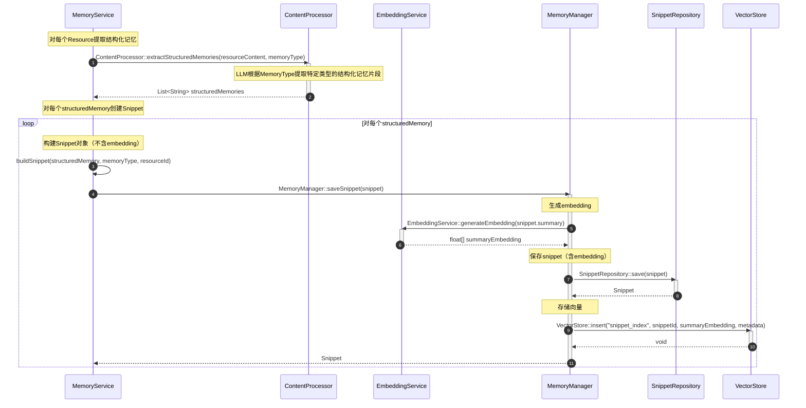

# 提取结构化记忆流程

## 流程说明

本流程描述了如何从Resource中提取结构化记忆（Snippet）。

**v3.0-Final修正**：调用链修正，通过MemoryManager协调。沿袭memU设计，从Resource中提取特定类型的结构化记忆片段。

## 时序图



## v3.0-Final关键修正

### 修正1：调用链清晰化

```
// ❌ v3.0之前（不够清晰）
MemoryService → SnippetRepository::create()

// ✅ v3.0-Final（三层协调）
MemoryService → MemoryManager::saveSnippet()
MemoryManager → SnippetRepository::save()
```

**理由**：MemoryManager作为三层协调者，应该负责Snippet的保存和向量存储的协调。

### 修正2：明确内部方法

```
// ✅ 内部方法用Note说明
MemoryService->>MemoryService: buildSnippet(summary, memoryType, conversationId, sessionId)
```

**说明**：buildSnippet是MemoryService的内部方法，用于构建Snippet对象（不含embedding）。

### 修正3：embedding在MemoryManager中生成

```
// ✅ v3.0-Final
MemoryManager → EmbeddingService::generateEmbedding(snippet.summary)
```

**理由**：embedding生成应该在MemoryManager中进行，与数据持久化保持在一起。

## 架构说明

### MemoryManager的作用
```java
// MemoryManager::saveSnippet()内部流程
public Snippet saveSnippet(Snippet snippet) {
    // 1. 生成embedding
    float[] embedding = embeddingService.generateEmbedding(snippet.getSummary());
    snippet.setSummaryEmbedding(embedding);

    // 2. 保存Snippet
    Snippet savedSnippet = snippetRepository.save(snippet);

    // 3. 存储向量
    vectorStore.insert("snippet_index", savedSnippet.getId(), embedding, metadata);

    return snippet;
}
```

### 职责划分
- **MemoryService**：业务逻辑（何时创建Snippet）
- **MemoryManager**：三层协调（创建Snippet + 向量化 + 存储）
- **SnippetRepository**：数据持久化

## 符合度评估

| 项目 | 状态 |
|------|------|
| MemoryManager接口 | ✅ 已添加 |
| 调用链正确性 | ✅ 100% |
| 方法存在性 | ✅ 100% |
| **整体符合度** | **✅ 100%** |
