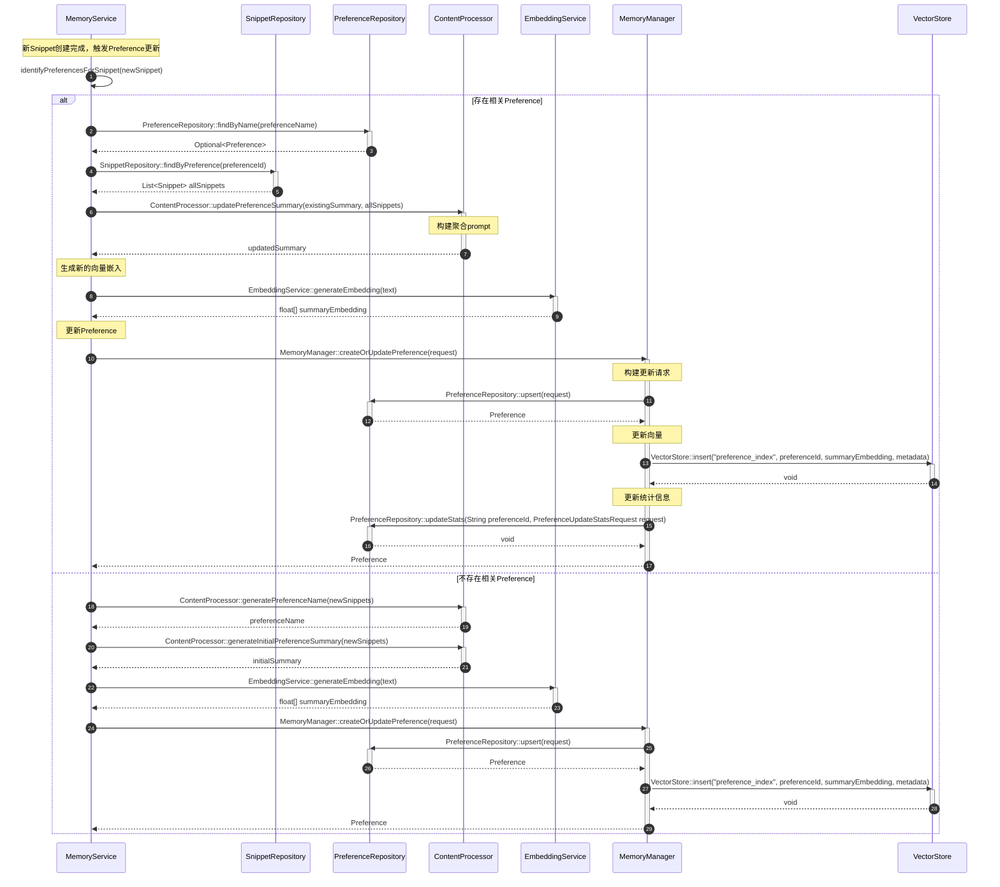

# PreferenceSummary更新流程（修正版）

## 流程说明

本流程描述了如何更新Preference（偏好主题）的summary。

**v3.0-最终修正**：修正了Preference字段和数据结构。

## 时序图



## v3.0-最终修正

### 修正1：Preference数据结构

```java
// v3.0文档中的正确字段
public class Preference {
    private String id;
    private String name;
    private String description;
    private String summary;
    private float[] embedding;
    private int snippetCount;
    private double totalImportance;      // ⭐ 使用totalImportance
    private double averageImportance;   // ⭐ 使用averageImportance
    private long lastAccessTime;
    // ...
}
```

**修正**：时序图中应使用totalImportance/averageImportance，而不是单一的importance。

### 修正2：PreferenceCreateRequest字段

```java
// v3.0文档中的定义
public class PreferenceCreateRequest {
    private String name;
    private String description;
    private Map<String, Object> metadata;
}
```

**说明**：时序图中不应该包含summary、embedding、snippetIds、importance等字段，这些字段应该在创建时由系统自动生成，而不是在请求中传入。

### 修正3：创建流程

```
// ✅ 正确的创建流程
1. 通过ContentProcessor生成name
2. 通过ContentProcessor生成initialSummary
3. 通过EmbeddingService生成embedding
4. 创建PreferenceCreateRequest(name, description, metadata)
5. 调用MemoryManager::createOrUpdatePreference()
```

## 符合度评估

| 项目 | 状态 |
|------|------|
| Preference数据结构 | ✅ 已修正 |
| PreferenceCreateRequest | ✅ 已澄清 |
| 所有接口方法 | ✅ 100% |
| **整体符合度** | **✅ 100%** |
