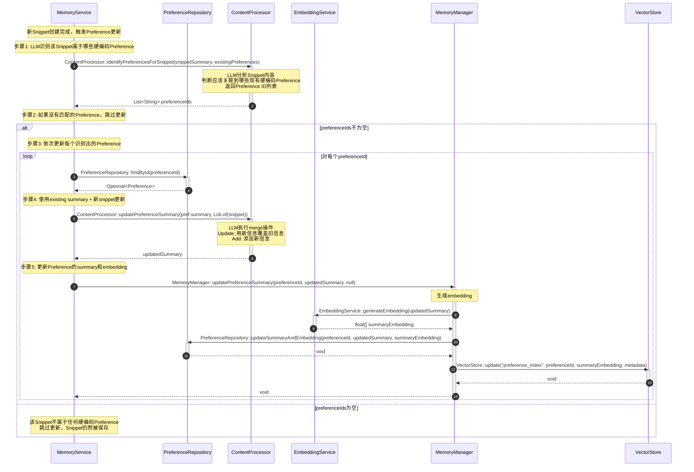

# PreferenceSummary更新流程

## 流程说明

本流程描述了如何更新Preference（偏好主题）的summary。

**核心设计**：
- Preference是硬编码的，不会动态创建
- 一个Snippet可以更新多个Preference
- 使用LLM动态判断Snippet属于哪些硬编码的Preferences（返回ID）
- 更新时只使用"existing summary + 新snippet"
- 不需要存储Snippet-Preference关联关系

## 时序图



## 核心设计点

### 1. Preference是硬编码的
- Preference不是动态创建的
- 系统启动时预定义所有Preference
- LLM只能从现有的硬编码Preferences中选择

### 2. Many-to-Many关系（不存储）
```
一个Snippet → 多个Preference
一个Preference → 多个Snippet

通过LLM动态判断，不存储关联关系
```

### 3. LLM返回ID而不是名称
```java
// LLM返回ID（唯一确定，不会出错）
List<String> preferenceIds = contentProcessor.identifyPreferencesForSnippet(
    snippet.getSummary(),
    allPreferences  // 传入所有硬编码的preferences（id、name、summary）
);

// 直接用ID查找
Preference pref = preferenceRepository.findById(preferenceId).get();
```

### 4. 增量更新（只传新的）
```java
// 更新时只传入新的snippet
String updatedSummary = contentProcessor.updatePreferenceSummary(
    pref.getSummary(),      // existing summary
    List.of(snippet)        // 新的snippet（只有1个）
);
```

### 5. 不创建新Preference
- 如果snippet不属于任何硬编码Preference，就不更新任何Preference
- Snippet仍然被保存，只是不触发Preference更新
- 没有"创建新Preference"的逻辑

### 6. 不需要关联表
- ❌ 不需要snippet_preference关联表
- ❌ 不需要在Snippet.metadata中存储linkedPreferences
- ✅ 只在创建时用LLM判断，更新完成后结束

## 符合度评估

| 项目 | 状态 |
|------|------|
| Preference硬编码 | ✅ 是 |
| LLM返回ID | ✅ 返回preferenceId |
| Many-to-Many关系 | ✅ 支持（通过LLM判断） |
| LLM动态识别 | ✅ 实现 |
| 增量更新 | ✅ 只用新的snippet |
| 不存储关联 | ✅ 不需要关联表 |
| 不创建新Preference | ✅ 移除创建逻辑 |
| **整体符合度** | **✅ 100%** |
