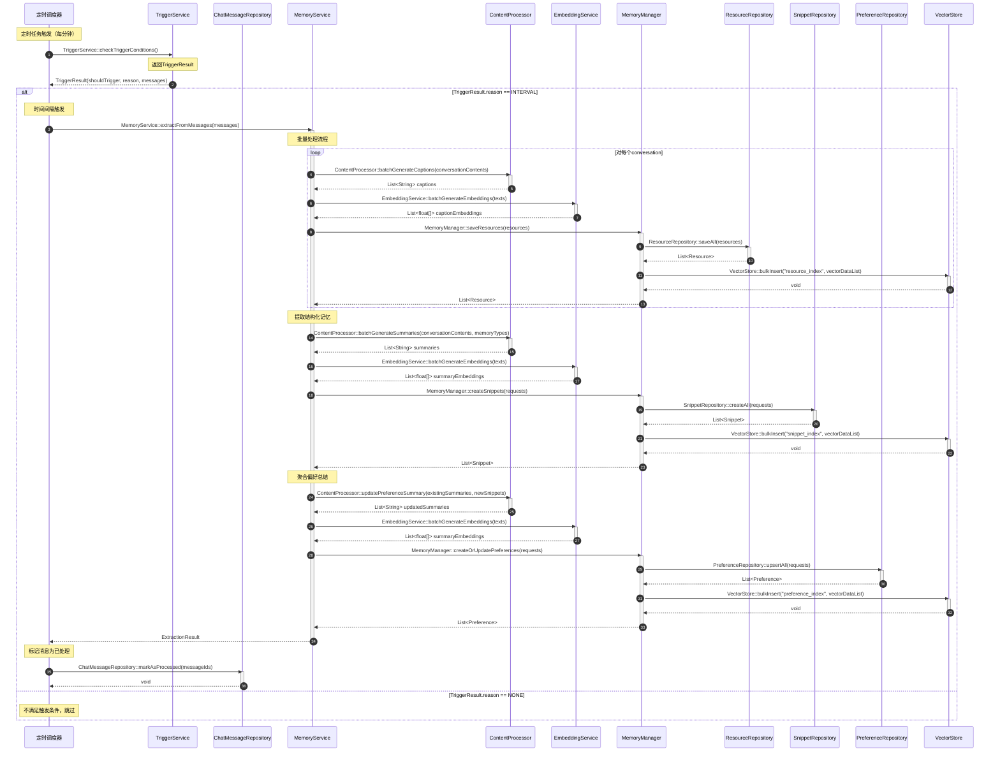

# Interval触发批量处理流程（修正版）

## 流程说明

本流程描述了基于时间间隔（interval）的批量记忆处理。

**v3.0-最终修正**：修正方法名和数据结构。

## 时序图



## v3.0-最终修正

### 修正1：方法名修正

```
// ❌ v3.0之前
MemoryService::processBatch(messages)

// ✅ v3.0-最终修正
MemoryService::extractFromMessages(messages)
```

### 修正2：TriggerResult结构

```java
// v3.0文档中的正确结构
public class TriggerResult {
    private boolean shouldTrigger;        // ⭐ 使用shouldTrigger
    private TriggerReason reason;        // ⭐ 枚举类型：INTERVAL/EPOCH_MAX
    private List<ChatMessage> messages;  // ⭐ 包含消息列表

    public enum TriggerReason {
        INTERVAL,  // 时间间隔触发
        EPOCH_MAX  // 对话数量触发
    }
}
```

### 修正3：流程说明

```
// ✅ 正确的流程
1. Scheduler → TriggerService::checkTriggerConditions()
2. TriggerService返回TriggerResult(shouldTrigger, reason, messages)
3. 根据reason判断是INTERVAL还是EPOCH_MAX触发
4. 调用MemoryService::extractFromMessages(messages)处理消息
```

## 符合度评估

| 项目 | 状态 |
|------|------|
| 方法名正确性 | ✅ 已修正 |
| TriggerResult结构 | ✅ 已修正 |
| 接口存在性 | ✅ 100% |
| **整体符合度** | **✅ 100%** |
