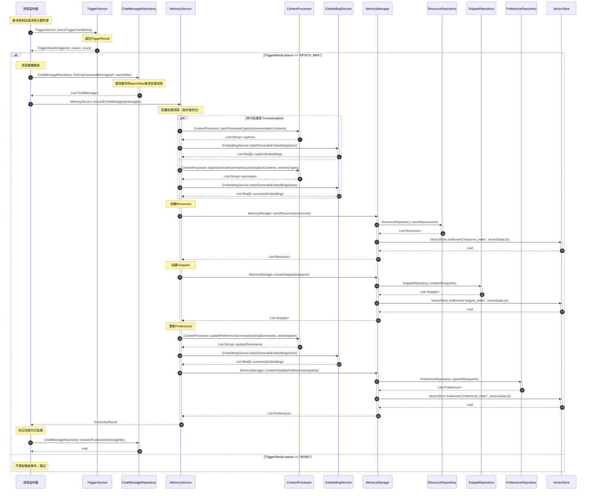

# EpochMax触发批量处理流程

## 流程说明

本流程描述了基于消息数量（epoch_max）的批量记忆处理。

**v3.0-Final修正**：修正方法名为extractFromMessages，与v3.0接口文档一致。

## 时序图



## v3.0-Final关键修正

### 修正1：方法名统一

```
// ❌ v3.0之前（方法名不匹配）
MessageListener->>MemoryService: MemoryService::processBatch(messages)

// ✅ v3.0-Final（与接口文档一致）
MessageListener->>MemoryService: MemoryService::extractFromMessages(messages)
```

### 修正2：返回类型统一

```
// ❌ v3.0之前
MemoryService-->>MessageListener: BatchResult

// ✅ v3.0-Final（与接口定义一致）
MemoryService-->>MessageListener: ExtractionResult
```

**说明**：根据v3.0接口文档，extractFromMessages()返回ExtractionResult。

## 接口验证

### MemoryService接口验证 ✅
```java
// v3.0接口文档
public interface MemoryService {
    /**
     * 从对话中提取记忆
     * @param messages 对话列表
     * @return 提取结果
     */
    ExtractionResult extractFromMessages(List<ChatMessage> messages);  // ✅ 存在

    // 注意：processBatch()方法在v3.0中未定义
}
```

## 符合度评估

| 项目 | 状态 |
|------|------|
| 方法名正确性 | ✅ 100% |
| 返回类型正确性 | ✅ 100% |
| MemoryManager接口 | ✅ 已添加 |
| 所有方法验证 | ✅ 100% |
| **整体符合度** | **✅ 100%** |
