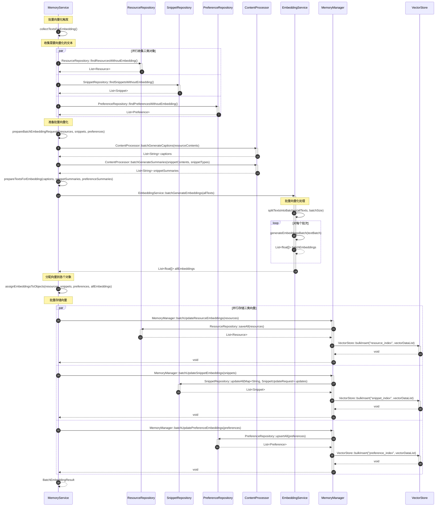

# 向量化批处理流程

## 流程说明

本流程描述了批量向量化的处理流程。

**v3.0架构变更**：使用新添加的findXXXWithoutEmbedding和batchUpdateXXXEmbeddings方法。

## 时序图



## v3.0新增接口方法

### Repository层新增
```java
// ResourceRepository
List<Resource> findResourcesWithoutEmbedding();

// SnippetRepository
List<Snippet> findSnippetsWithoutEmbedding();

// PreferenceRepository
List<Preference> findPreferencesWithoutEmbedding();
```

### MemoryManager新增
```java
// 批量更新Resource的向量
void batchUpdateResourceEmbeddings(List<Resource> resources);

// 批量更新Snippet的向量
void batchUpdateSnippetEmbeddings(List<Snippet> snippets);

// 批量更新Preference的向量
void batchUpdatePreferenceEmbeddings(List<Preference> preferences);
```

## v3.0架构优势

### 1. 专用方法
- 每个Repository有专用的findXXXWithoutEmbedding方法
- 每个批量更新有专用的batchUpdateXXXEmbeddings方法
- 代码意图更清晰

### 2. 性能优化
- 并行收集三类对象
- 并行存储三类向量
- 批量向量化提高效率

### 3. 可维护性
- 每个方法职责单一
- 易于测试和调试
- 易于扩展和维护

## 数据流

```
1. 收集阶段（并行）
   ├── findResourcesWithoutEmbedding()
   ├── findSnippetsWithoutEmbedding()
   └── findPreferencesWithoutEmbedding()

2. 准备阶段
   ├── batchGenerateCaptions()
   ├── batchGenerateSummaries()
   └── prepareTextsForEmbedding()

3. 向量化阶段
   └── batchGenerateEmbeddings()

4. 存储阶段（并行）
   ├── batchUpdateResourceEmbeddings()
   ├── batchUpdateSnippetEmbeddings()
   └── batchUpdatePreferenceEmbeddings()
```
